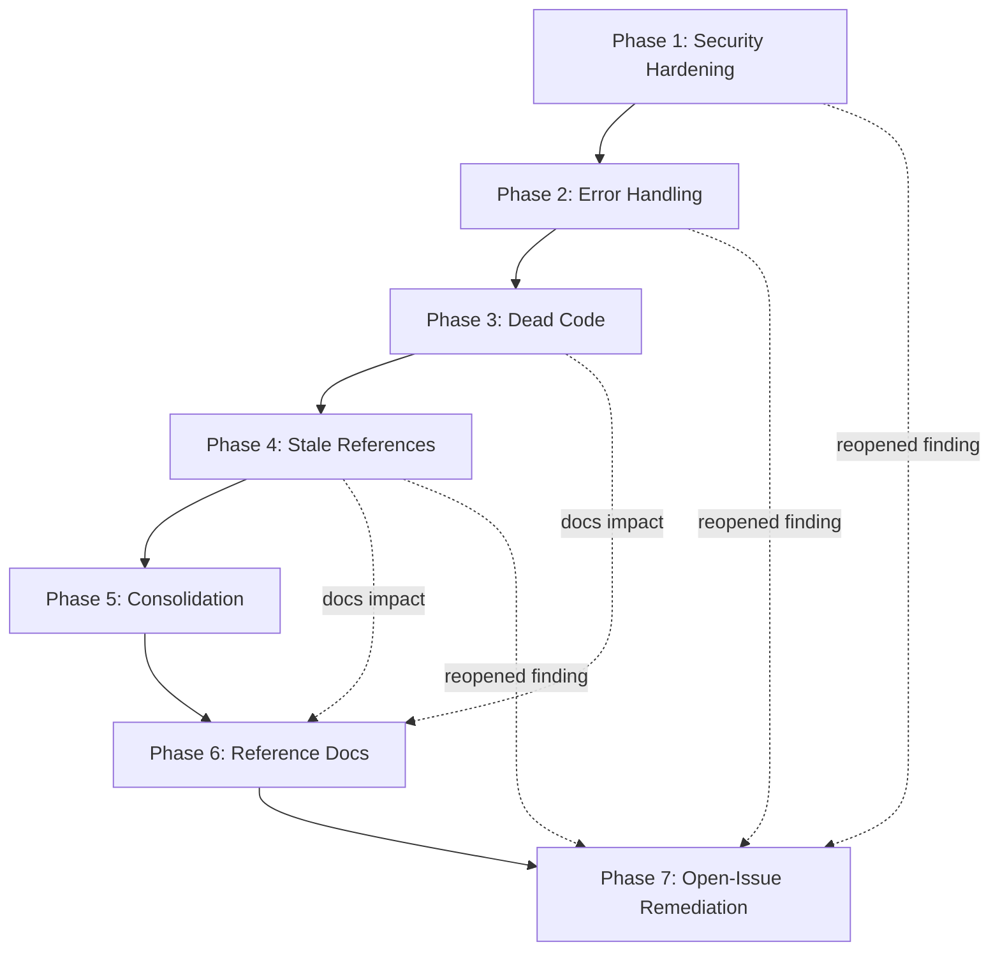

<!--
SPDX-FileCopyrightText: 2026 XZatoma contributors
SPDX-License-Identifier: Apache-2.0
-->

# Codebase Cleanup Implementation Plan

## Overview

This plan defines a phased approach to refactoring and hardening the XZatoma
`src/` codebase (~117k lines across 130 Rust files). It consolidates findings
from a seven-part audit: duplicate code, dead code and suppression annotations,
error-handling consistency, unfinished work (TODOs/placeholders), stale
development-phase references, security vulnerabilities, and reference-
documentation accuracy.

The work is ordered by risk and value, not by module. Security fixes and the one
security-relevant functional stub come first, followed by error-handling
correctness, then low-risk clutter removal (dead code and stale labels), the
larger structural de-duplication effort, and finally a documentation-accuracy
pass that reconciles `docs/reference/` with the code (including the changes made
by earlier phases). No backward compatibility is required, which allows
aggressive deletion and signature changes.

Documentation is not deferred to the end alone: every phase that changes module
layout, public API, config keys, or commands MUST update the affected
`docs/reference/` file in the same change. Phase 6 is the final reconciliation
sweep for docs that are already stale today, independent of the refactor.

The headline is that XZatoma is already in good shape: zero `TODO`/`FIXME`
markers, zero `todo!()`/`unimplemented!()` macros, a clean `cargo clippy` run,
only two real `#[allow(...)]` attributes, and a tiny production
`unwrap`/`expect` surface. The highest-value work is therefore (a) a handful of
concrete security fixes plus a real Zed elicitation implementation for the one
functional stub, (b) standardizing error propagation onto helpers that already
exist, and (c) a full DRY consolidation of the provider and watcher layers
(~1,200+ lines removed), followed by the documentation reconciliation.

## Current State Analysis

### Existing Infrastructure

- **Error architecture**: A centralized `XzatomaError` enum in
  [`src/error.rs`](../../src/error.rs) with ~60 variants, `#[from]` conversions,
  and source-preserving `#[source]` variants. Module-local `thiserror` enums
  (`acp/error.rs`, `watcher/xzepr/*`, `tools/file_utils.rs`, etc.) convert
  upward. `storage/mod.rs` already defines structured helper builders
  (`storage_query_error`, `storage_row_decode_error`).
- **Security controls**: [`src/security.rs`](../../src/security.rs) provides URL
  validation, IP blocklists, and secret redaction;
  [`src/tools/fetch.rs`](../../src/tools/fetch.rs) has an `SsrfValidator`;
  [`src/tools/terminal.rs`](../../src/tools/terminal.rs) uses a shell-free
  tokenizer; [`src/tools/file_utils.rs`](../../src/tools/file_utils.rs) has a
  `PathValidator` with canonicalization;
  [`src/acp/server.rs`](../../src/acp/server.rs) requires bearer auth for
  non-loopback binds.
- **Reusable helpers already present**: `providers/types.rs` shared wire types,
  `providers::validate_message_sequence`, `providers::convert_tools_from_json`,
  `tools::parse_tool_args`, `mcp::transport::Transport`, and
  `test_utils::TestProvider`/`TestProviderBuilder`.
- **Quality gates**: `cargo fmt`, `cargo check`, `cargo clippy -D warnings`, and
  a keyring-skipping test invocation are documented in `AGENTS.md`.

### Identified Issues

- **Security (2 High, 3 Medium, 3 Low)**: DNS-rebinding SSRF in the fetch tool
  and OAuth path (resolve-then-reconnect TOCTOU); non-constant-time ACP
  bearer-token comparison; unvalidated URL open from untrusted MCP servers; weak
  command denylist; incomplete JSON secret redaction; no `cargo audit` in CI;
  Kafka plaintext default.
- **Functional stub**: `IdeRequestPermissionTool::execute` auto-approves
  permissions instead of prompting (security-relevant no-op).
- **Error handling**: `storage/mod.rs` flattens 44 error sites to
  `Storage(String)`, discarding the source chain its own helpers would preserve;
  a genuinely fallible `.expect()` on reqwest-client build; a `panic!` on
  semaphore close; 9 unjustified regex `unwrap()`s in `fetch.rs`; a few locks
  missing `// SAFETY:` comments.
- **Dead code**: 19 truly-dead `pub` items (notably an unimplemented MCP
  `tasks/*` DTO cluster); one `#[allow(clippy::too_many_arguments)]` on
  `run_chat` (with a dead `_safe` param); ~206 test-only `pub` items that are
  over-exposed.
- **Stale references**: ~29 "Phase N" development labels in `src/` (mostly test
  section headers); ~18 phase-named files in `docs/explanation/`.
- **Duplication**: Triplicated provider wire structs and conversion logic;
  duplicated SSE streaming accumulators; Kafka security enums/parsers defined
  2-4 times; duplicated watcher lifecycle boilerplate; repeated tool
  scaffolding; ~290 lines of inline mock providers; a config-lock error string
  repeated ~13 times.
- **Stale reference documentation**: A dedicated audit of `docs/reference/` (24
  files) found several out-of-date docs. The worst is
  [`architecture.md`](../reference/architecture.md), whose module map lists
  files that do not exist (`agent/executor.rs`, `tools/file_ops.rs`,
  `watcher/generic/producer.rs`), a nonexistent top-level `src/xzepr/` shim, a
  wrong ACP tree (`routes.rs`/`handlers.rs`/`run.rs`/`events.rs`), and omits
  real files (`watcher/plan_executor.rs`, `watcher/topic_admin.rs`,
  `security.rs`, `test_utils.rs`). Other stale docs:
  [`provider_abstraction.md`](../reference/provider_abstraction.md) (lists
  `base.rs`, wrong default model), [`api.md`](../reference/api.md) (omits
  `OpenAIProvider`, references nonexistent `file_ops::FileOpsTool`),
  [`mcp_configuration.md`](../reference/mcp_configuration.md) (claims sampling
  is unimplemented when it is),
  [`chat_commands.md`](../reference/chat_commands.md) (documents a nonexistent
  `/summarize`, omits several real commands),
  [`model_management.md`](../reference/model_management.md) and
  [`cli.md`](../reference/cli.md)/[`quick_reference.md`](../reference/quick_reference.md)
  (omit the OpenAI provider), and
  [`watcher_environment_variables.md`](../reference/watcher_environment_variables.md)
  (missing 5 env vars).

## Implementation Phases

### Phase 1: Security Hardening

Addresses the highest-risk findings first. These are correctness/safety fixes
with narrow blast radius.

#### Task 1.1 Foundation Work

- Add the `subtle` crate (or an existing constant-time primitive) to
  `Cargo.toml` for timing-safe comparison.
- Introduce a shared IP-pinning DNS helper usable by both the fetch tool and the
  OAuth validation path, so a hostname is resolved once and the connection
  targets the validated IP.
- Add a `request_permission` method to
  [`IdeBridge`](../../src/acp/ide_bridge.rs) that issues a real ACP
  `session/request_permission` client request, following the existing
  `write_text_file`/`create_terminal` pattern (clone `connection` +
  `session_id`, `tokio::task::spawn` + `send_request_to(AcpClientRole, ...)`,
  `.block_task().await`, map SDK errors to `XzatomaError::Internal`). This is
  the foundation the IDE permission stub replacement depends on (Task 1.2).

#### Task 1.2 Add Foundation Functionality

- **H1 - DNS-rebinding SSRF**: In
  [`src/tools/fetch.rs`](../../src/tools/fetch.rs)
  (`resolve_host_ips`/`validate` around lines 206-212 and 482-490) resolve the
  host once, pin the validated IP via `reqwest::ClientBuilder::resolve()` (or a
  custom resolver), and reject responses whose peer address is non-public. Apply
  the same fix to `validate_public_https_url` in
  [`src/security.rs`](../../src/security.rs) (~line 148) used by the OAuth flow.
- **H2 - Timing-safe token compare**: Replace the `==` bearer-token comparison
  in [`src/acp/server.rs`](../../src/acp/server.rs) (~line 665) with a
  constant-time comparison, and enforce a minimum token length/entropy in
  `validate_acp_config`.
- **M1 - URL scheme validation**: In
  [`src/mcp/elicitation.rs`](../../src/mcp/elicitation.rs) (`handle_url`, ~lines
  314-329) validate that the URL scheme is `https` (or an explicit allowlist)
  before invoking the OS opener; require user confirmation with the full URL.
- **Functional stub - IDE permission (real Zed elicitation)**: Replace the
  auto-approve body of `IdeRequestPermissionTool::execute` in
  [`src/tools/ide_tools.rs`](../../src/tools/ide_tools.rs) (~lines 629-651) with
  a real call to the new `IdeBridge::request_permission` method from Task 1.1.
  Concrete design (SDK types verified against `agent-client-protocol` v1.2 /
  schema v1):
  - Build an
    `acp::RequestPermissionRequest::new(session_id, tool_call, options)` where
    `tool_call` is an `acp::ToolCallUpdate` synthesized from the tool call's id
    and `params.operation` (title) with kind `Other`, and `options` is a
    `Vec<acp::PermissionOption>` offering: "Allow"
    (`PermissionOptionKind::AllowOnce`), "Allow for session" (`AllowAlways`),
    "Reject" (`RejectOnce`), and "Reject for session" (`RejectAlways`), each
    with a stable `PermissionOptionId`.
  - Send it via the bridge and map `RequestPermissionResponse.outcome`:
    `RequestPermissionOutcome::Selected(SelectedPermissionOutcome { option_id })`
    -> `approved: true` when `option_id` is one of the allow options, else
    `approved: false`; `RequestPermissionOutcome::Cancelled` ->
    `approved: false` with a `"cancelled": true` note.
  - The tool needs the active tool-call id to build `ToolCallUpdate`; thread it
    into `IdeRequestPermissionTool` (constructor param or execution context) so
    the permission prompt attaches to the correct tool call in Zed's UI.
  - Fail-closed if the client did not advertise the capability or the bridge
    request errors (return `approved: false`, never default to `true`).
  - Update the struct/`execute` doc comments and the `"note"` string to remove
    the "auto-granted"/"in a later phase" wording.

#### Task 1.3 Integrate Foundation Work

- **M3 - Secret redaction**: Extend `redact_sensitive_text` in
  [`src/security.rs`](../../src/security.rs) (~lines 203-218) to redact JSON
  key/value pairs for a broader key set (`*token*`, `*secret*`, `password`,
  `code`, `client_secret`) rather than trailing-space markers. Confirm it is
  applied at the `tracing::error!` sites in `providers/copilot.rs`.
- **M2 - Command denylist posture**: Document the denylist in
  [`src/tools/terminal.rs`](../../src/tools/terminal.rs) as best-effort defense
  in depth; optionally require confirmation for interpreter invocations
  (`python`, `node`, `sh`, `bash`, `ruby`, `perl`) even in `FullAutonomous`
  mode.
- **L2 - Kafka transport**: Ensure production config paths surface a warning
  when `SecurityProtocol::Plaintext` is used and untrusted Kafka payloads are
  size-bounded.

#### Task 1.4 Testing Requirements

- Unit tests for IP-pinning: validation passes for a public IP but the
  connection is refused when a second resolution returns a private/loopback IP
  (simulate via the custom resolver).
- Unit test proving the ACP token comparison rejects wrong-length and
  wrong-value tokens; add a fixed-length property test.
- Unit tests for `handle_url` rejecting `file://`, `vscode://`, `smb://`, and
  accepting `https://`.
- Unit tests for the IDE permission flow using a fake ACP connection/bridge:
  `Selected` allow option -> `approved: true`; `Selected` reject option ->
  `approved: false`; `Cancelled` -> `approved: false`; missing capability or
  bridge error -> fail-closed `approved: false`. Assert the request carries the
  four permission options and the operation title.
- Extend `security.rs` redaction tests with JSON `access_token`/`client_secret`
  payloads.

#### Task 1.5 Deliverables

- [x] Fetch tool and OAuth path pin validated IPs (H1).
- [x] Constant-time ACP bearer-token comparison plus minimum-entropy check (H2).
- [x] MCP `handle_url` scheme allowlist with confirmation (M1).
- [x] `IdeBridge::request_permission` implemented; `IdeRequestPermissionTool`
      issues a real Zed `session/request_permission` prompt and honors the
      user's choice (fail-closed on error), replacing the auto-approve stub.
- [x] JSON-aware secret redaction (M3).
- [x] `cargo audit --deny warnings` wired into the `Makefile` (`make audit`) and
      documented in `AGENTS.md`; unmaintained transitive advisories are ignored
      with justification in `.cargo/audit.toml` (L1). No standalone CI workflow
      was added at the user's request.

#### Task 1.6 Success Criteria

- All new security tests pass;
  `cargo clippy --all-targets --all-features -- -D warnings` is clean;
  `cargo audit` reports no unresolved advisories or an explicitly reviewed
  allowlist. No production code path can reach an internal address via the fetch
  or OAuth flows. In a live Zed session, `ide_request_permission` displays a
  real permission prompt and the agent proceeds only when the user approves; a
  denied or cancelled prompt returns `approved: false`.

### Phase 2: Error-Handling Standardization

Adopts patterns the codebase already defines to stop discarding error context
and to remove production panics.

#### Task 2.1 Feature Work

- **Storage context loss (highest value)**: In
  [`src/storage/mod.rs`](../../src/storage/mod.rs) replace the 44
  `map_err(|e| XzatomaError::Storage(e.to_string()))` sites with the existing
  structured helpers (`storage_query_error`, `storage_row_decode_error`,
  `storage_serialization_error`, etc.) so the `#[source]` chain is preserved,
  matching the newer ACP code paths.
- **Fallible expects/panics**: Convert
  `.expect("failed to build reqwest client")` in
  [`src/mcp/transport/http.rs`](../../src/mcp/transport/http.rs) (~line 118) to
  a `Result` return; replace `panic!("Semaphore closed")` in
  [`src/tools/parallel_subagent.rs`](../../src/tools/parallel_subagent.rs)
  (~line 306) with an error variant.
- **Fetch regex unwraps**: Convert the 9 `Regex::new(...).unwrap()` calls in
  `html_to_markdown` ([`src/tools/fetch.rs`](../../src/tools/fetch.rs), ~lines
  606-663) to `LazyLock`/`once_cell` statics compiled once.

#### Task 2.2 Integrate Feature

- Add `// SAFETY:` justification comments to the remaining unjustified
  production locks/expects: `agent/core.rs` lines ~778, ~1239, ~1707;
  `commands/mod.rs` ~850; `tools/terminal.rs` ~161.
- Add explicit intent (`.ok()` with a log, or a comment) to the fire-and-forget
  `let _ = ...send()`/`table.print()` sites in `mcp/transport/http.rs`,
  `acp/stdio.rs`, and `commands/models.rs`.

#### Task 2.3 Configuration Updates

- Add scoped `#![warn(clippy::unwrap_used, clippy::expect_used)]` for non-test
  builds so new production unwraps/expects fail CI under the existing
  `-D warnings` policy. Verify the lint does not fire on test or doc-example
  code.

#### Task 2.4 Testing Requirements

- Regression tests asserting storage errors preserve their source (e.g. downcast
  or `source()` is `Some`).
- Test that `mcp/transport/http.rs` client construction failure returns `Err`
  rather than panicking.
- Test that a closed semaphore in `parallel_subagent` yields a handled error.

#### Task 2.5 Deliverables

- [x] `storage/mod.rs` fully migrated to structured error helpers (0 remaining
      `Storage(e.to_string())`).
- [x] No production `panic!`/`.expect()` on genuinely fallible operations.
- [x] Static regexes in `fetch.rs`; all production `unwrap`/`expect` either
      removed or justified.
- [x] Clippy `unwrap_used`/`expect_used` enforced for production builds.

#### Task 2.6 Success Criteria

- Production `unwrap` count drops from 19 toward 0 (remaining ones carry
  justifications); `cargo clippy` with the new lints passes; storage error
  chains are observable in tests.

### Phase 3: Dead Code and Annotation Cleanup

Zero-to-low-risk deletions that shrink the public surface.

#### Task 3.1 Feature Work

- Delete the unimplemented MCP `tasks/*` DTO cluster in
  [`src/mcp/types.rs`](../../src/mcp/types.rs) (`CreateTaskResult`,
  `TasksGetParams`, `TasksResultParams`, `TasksCancelParams`, `TasksListParams`,
  `ResourceTemplate`, `CancelledParams`) unless the feature is intentionally
  being kept; decide on `TasksListResponse` (test-only).
- Delete the 12 other confirmed-dead functions/methods identified in the audit
  (e.g. `acp/runtime.rs::system_text_message`, `agent/core.rs::new_boxed` and
  `clear_transient_system_messages`, `tools/fetch.rs::with_rate_limit`,
  `tools/registry_builder.rs::with_activate_skill_tool`,
  `tools/terminal.rs::set_safety_mode`, and the rest of the 19-item list).

#### Task 3.2 Integrate Feature

- Refactor `run_chat` in [`src/commands/mod.rs`](../../src/commands/mod.rs)
  (~line 492) to take a `RunChatOptions` struct (with `Default`/builder),
  removing the `#[allow(clippy::too_many_arguments)]` and the dead `_safe`
  parameter. Update all call sites.

#### Task 3.3 Configuration Updates

- Begin an incremental, module-by-module visibility pass downgrading test-only
  `pub` items (~206) to `pub(crate)`/private or `#[cfg(test)]`-gating them.
  Start with the densest offenders: `acp/server.rs`, `providers/copilot.rs`,
  `acp/tool_notifications.rs`, `tools/ide_tools.rs`. Track this as an ongoing
  effort rather than a single change.

#### Task 3.4 Testing Requirements

- Rely on `cargo check --all-targets --all-features` and the standard test
  invocation to confirm nothing referenced the deleted items; run the full gate
  after each deletion batch.

#### Task 3.5 Documentation Updates

- Update
  [`docs/reference/mcp_configuration.md`](../reference/mcp_configuration.md) to
  remove any `tasks/*` capability documentation tied to the deleted DTO cluster.
- If any deleted public item was documented in
  [`docs/reference/api.md`](../reference/api.md) or
  [`docs/reference/subagent_api.md`](../reference/subagent_api.md), remove those
  references.

#### Task 3.6 Deliverables

- [x] 19 dead public items removed.
- [x] `run_chat` converted to `RunChatOptions`; no remaining
      `#[allow(clippy::too_many_arguments)]`.
- [x] First module batch of visibility tightening merged.
- [x] Reference docs mentioning deleted items updated.

#### Task 3.7 Success Criteria

- `cargo build`, `cargo clippy -D warnings`, and the test suite pass with zero
  references to removed items; the only remaining `#[allow(...)]` is the
  intentional `clippy::module_inception` on `watcher/xzepr/mod.rs`.

### Phase 4: Stale Reference Cleanup

Mechanical, low-risk hygiene.

#### Task 4.1 Feature Work

- Remove or reword the ~29 "Phase N" development labels in `src/` per the audit
  (test-section headers in `cli.rs`, `acp/stdio.rs`, `agent/core.rs`,
  `config.rs`, `acp/available_commands.rs`; doc comments in `config.rs`,
  `acp/manifest.rs`, `acp/session.rs`, `tools/ide_tools.rs`, `mcp/protocol.rs`).
  Preserve the ~12 legitimate domain uses of "phase" (streaming replay phase,
  drain/publish phase, reasoning phase, MCP protocol phases, lifecycle phases).

#### Task 4.2 Integrate Feature

- Archive or rename the ~18 phase-named `docs/explanation/*.md` files into
  `docs/archive/` (the convention already exists), preserving AGENTS.md Rule 5
  history rather than deleting. Update any cross-links in `docs/`, including
  `phaseN_*` links in [`model_management.md`](../reference/model_management.md)
  (any remaining reference-doc link fixes are finalized in Phase 6).

#### Task 4.3 Configuration Updates

- Run `markdownlint --fix` and
  `prettier --write --parser markdown --prose-wrap always` on every touched
  Markdown file per AGENTS.md Rule 4.

#### Task 4.4 Testing Requirements

- Grep gate: `rg -ni "phase [0-9]" src` returns only reviewed/legitimate
  matches.
- Confirm doc links resolve after archival.

#### Task 4.5 Deliverables

- [x] Stale "Phase N" labels removed/reworded in `src/`.
- [x] Phase-named implementation docs archived/renamed.
- [x] All touched Markdown passes lint/format checks.

#### Task 4.6 Success Criteria

- No stale development-phase labels remain in `src/`; the documentation tree
  reflects current features; quality gates pass.

### Phase 5: Code Consolidation (DRY)

The largest, most structural effort (~1,200-1,600 removable lines). Committed as
in-scope (full DRY consolidation); sequenced so mechanical wins land before the
provider-layer refactor.

#### Task 5.1 Feature Work

- **P3 - Kafka security config**: Create a single `watcher/kafka_security.rs`
  with the canonical `SecurityProtocol`/`SaslMechanism`/`SaslConfig` and shared
  `parse_*`/`apply_security_config`; delete the 2-4 duplicate definitions in
  `watcher/generic/result_producer.rs`, `watcher/xzepr/consumer/config.rs`,
  `watcher/topic_admin.rs`, `watcher/xzepr/watcher.rs`.
- **P7 - Config-lock helper**: Add a shared read-lock helper to replace the ~13
  verbatim `map_err(|_| ... "Failed to acquire read lock on config")` sites
  across the three providers.

#### Task 5.2 Integrate Feature

- **P6 - Test boilerplate**: Replace the 12 inline `MockProvider` structs in
  `providers/trait_mod.rs` with `TestProviderBuilder` (extending it as needed);
  add a `KafkaWatcherConfig` test builder/`Default` to replace ~46 literals.
- **P1 - Provider wire types**: Promote the OpenAI-style chat wire structs into
  `providers/types.rs` as canonical types; alias them from `copilot.rs` (byte-
  compatible) the way `ollama.rs` already does; extract shared
  `convert_messages`/`convert_response_message`.
- **P2 - Streaming**: Add `providers/streaming.rs` with a generic SSE reader and
  a single `ChatDeltaAccumulator` merging `StreamAccumulator` and
  `ChatCompletionsAccumulator` (keep `ResponsesAccumulator` separate).
- **P8 - Provider HTTP errors**: Add `providers/http.rs` with shared
  `api_error`/`check_response` helpers to centralize UNAUTHORIZED handling.
- **P4/P5 - Watcher/tool boilerplate**: Extract shared watcher lifecycle helpers
  (`build_producer`, `build_execution_semaphore`, `resolve_output_topic`) and a
  `PathTool` base plus a `validate_or_err` helper for the ~90
  `ToolResult::error` path-validation sites. Follow AGENTS.md "wait for 3
  examples" guidance; skip any premature macro.

#### Task 5.3 Documentation Updates

- Because this phase introduces new modules (`providers/streaming.rs`,
  `providers/http.rs`, `watcher/kafka_security.rs`) and relocates provider wire
  types, update the docs that describe internals:
  [`provider_abstraction.md`](../reference/provider_abstraction.md) ("File
  Layout" section) and
  [`provider_api_comparison.md`](../reference/provider_api_comparison.md).
- If the Kafka-security consolidation renames or relocates any
  `XZEPR_KAFKA_*`/security keys, update
  [`watcher_environment_variables.md`](../reference/watcher_environment_variables.md)
  and [`configuration.md`](../reference/configuration.md) to match. Coordinate
  these edits with Phase 6 so the module trees in
  [`architecture.md`](../reference/architecture.md) reflect the new modules.

#### Task 5.4 Configuration Updates

- None expected beyond module wiring in `providers/mod.rs`, `watcher/mod.rs`,
  and `tools/mod.rs`.

#### Task 5.5 Testing Requirements

- Consolidate the triplicated provider conversion tests into one shared module
  once the shared conversion helpers land; keep behavior parity tests for each
  provider's divergent bits (Copilot image-drop warning, Ollama native
  `images`).
- Add tests for the shared SSE reader (buffering, `[DONE]`, idle timeout) and
  the merged accumulator.
- Retain/port existing Kafka-security parse tests to the consolidated module.

#### Task 5.6 Deliverables

- [x] Single Kafka-security module; duplicates deleted (P3).
- [x] Shared config read-lock helper (P7).
- [x] Inline mock providers and Kafka config literals replaced by builders (P6).
- [x] Canonical provider wire types and shared conversion helpers (P1).
- [x] Shared streaming reader/accumulator (P2) and HTTP error helpers (P8).
- [x] Shared watcher/tool helpers (P4/P5).
- [x] Provider and watcher reference docs updated for the new module layout.

#### Task 5.7 Success Criteria

- Net reduction of ~1,200+ lines with no behavior change; all three providers
  and both watchers pass their existing tests;
  `cargo fmt`/`check`/`clippy -D warnings`/test gate is green; test coverage
  remains greater than 80%; no reference doc describes a module path that the
  refactor removed or renamed.

### Phase 6: Reference Documentation Accuracy

Reconciles `docs/reference/` with the actual code. Some fixes address staleness
that exists today (independent of the refactor); others land the final module-
tree updates after Phase 5. This phase has no code changes -- only Markdown --
and every edited file must pass the AGENTS.md Rule 4 lint/format gate.

#### Task 6.1 Feature Work

- **`architecture.md` (highest priority, explicitly requested)**: Correct the
  module map in [`architecture.md`](../reference/architecture.md) against the
  real tree:
  - Remove the nonexistent top-level `src/xzepr/` "backward-compatible shim"
    (xzepr exists only under `src/watcher/xzepr/`).
  - Fix wrong file paths: `agent/executor.rs` (executor lives in `src/acp/`),
    `tools/file_ops.rs` (tools are per-file, e.g. `terminal.rs`,
    `read_file.rs`), and `watcher/generic/producer.rs` (actual name is
    `result_producer.rs`).
  - Add omitted real files: `watcher/plan_executor.rs`,
    `watcher/topic_admin.rs`, the generic tree's
    `consumer.rs`/`event.rs`/`event_handler.rs`/ `result_event.rs`, and
    top-level `security.rs` and `test_utils.rs`.
  - Replace the wrong ACP module tree (`routes.rs`, `handlers.rs`, `run.rs`,
    `events.rs` do not exist) with the real files (`stdio.rs`,
    `available_commands.rs`, `ide_bridge.rs`, `prompt_input.rs`,
    `session_config.rs`, `session_mode.rs`, `tool_notifications.rs`, etc.).
  - Add the OpenAI provider to the provider-layer description.
  - Remove the "in later phases" Phase-label wording (line ~711).

#### Task 6.2 Integrate Feature

- **`provider_abstraction.md`**: Fix the "File Layout" section (replace
  `base.rs` with `trait_mod.rs` + `types.rs`; add `factory.rs`, `cache.rs`,
  `capabilities.rs`) and correct the default Copilot model to match `config.rs`
  (`gpt-5-mini`).
- **`api.md`**: Add `OpenAIProvider` to the provider list; remove the
  nonexistent `file_ops::FileOpsTool` reference; fix the example default model.
- **`mcp_configuration.md`**: Remove the "sampling handler is not yet
  implemented" claim (`XzatomaSamplingHandler` implements it in
  `src/mcp/sampling.rs`).
- **`chat_commands.md`**: Remove the nonexistent `/summarize` command; add the
  implemented commands/aliases (`/mentions`, `/models`, `/planning`, `/write`,
  `/safe`, `/yolo`, `/quit`, `/mod`) verified against
  `src/commands/special_commands.rs`.
- **`model_management.md`**, **`cli.md`**, **`quick_reference.md`**: Add the
  OpenAI provider everywhere provider options are listed (currently only
  Copilot/Ollama); add the `agent` subcommand to `cli.md`.
- **`watcher_environment_variables.md`**: Add the 5 missing env vars
  (`XZATOMA_WATCHER_EXECUTION_MODE`, `XZATOMA_WATCHER_GROUP_ID`,
  `XZEPR_KAFKA_SSL_CA_LOCATION`, `XZEPR_KAFKA_SSL_CERT_LOCATION`,
  `XZEPR_KAFKA_SSL_KEY_LOCATION`).
- **`copilot_provider.md`**: Verify and correct the default model references.
- Remove any `phaseN_*` explanation-doc links (e.g. in `model_management.md`)
  left dangling after Phase 4's doc archival.

#### Task 6.3 Configuration Updates

- Run `markdownlint --fix --config .markdownlint.json` and
  `prettier --write --parser markdown --prose-wrap always` on every edited
  reference doc, per AGENTS.md Rule 4.

#### Task 6.4 Testing Requirements

- Verification pass: for each edited doc, grep every file path, symbol,
  provider, command, config key, and env var it names and confirm the referent
  exists in the code (`find_path`/`grep`). No manual runtime testing required.
- Confirm all intra-doc and cross-doc links resolve.

#### Task 6.5 Deliverables

- [x] `architecture.md` module trees (top-level, watcher, ACP, providers, tools,
      agent) match the real `src/` tree, including Phase 5's new modules.
- [x] `provider_abstraction.md`, `api.md`, `mcp_configuration.md`,
      `chat_commands.md`, `model_management.md`, `cli.md`, `quick_reference.md`,
      `watcher_environment_variables.md`, `copilot_provider.md` corrected.
- [x] No reference doc names a nonexistent file, symbol, command, or env var.
- [x] All edited Markdown passes lint/format checks.

#### Task 6.6 Success Criteria

- Every referent named in `docs/reference/` resolves to real code; the docs
  reflect three providers (Copilot/Ollama/OpenAI), the true module layout after
  the refactor, and the actual command/env-var surface; no "Phase N" or
  aspirational "not yet implemented" statements remain where the feature exists.

### Phase 7: Open-Issue Remediation

Closes the residual partial items surfaced by a post-implementation audit of
Phases 1-6. These are the security-confirmation gate and Kafka payload bound
left partial in Phase 1, the two failure-path tests approximated in Phase 2, the
IDE-permission test gaps from Phase 1, and the dangling documentation links left
after Phase 4's archival. No new features -- hardening, completeness, and test
fidelity only.

#### Task 7.1 Feature Work

- **M1 - URL open confirmation (finish the partial)**: In
  [`src/mcp/elicitation.rs`](../../src/mcp/elicitation.rs) (`handle_url`, ~lines
  342-358) the `https` scheme allowlist is already enforced, but the URL is
  printed to stderr and opened without an approval gate. Require explicit user
  confirmation showing the full URL before invoking the OS opener, and fail
  closed (do not open) when confirmation is declined or the session is
  non-interactive/headless. Reuse the existing headless fail-closed branch
  (~lines 330-336) so headless sessions never auto-open.
- **L2 - Kafka payload size bound (finish the partial)**: Add a configurable
  maximum payload size enforced when ingesting untrusted Kafka messages in both
  [`src/watcher/generic/event.rs`](../../src/watcher/generic/event.rs)
  (`GenericPlanEvent::new`, ~line 158) and the XZepr consumer ingestion path.
  Reject oversized payloads with a logged, source-preserving error (using the
  structured error helpers, not a flattened string) before parsing. Default to a
  sane cap (for example 1 MiB).

#### Task 7.2 Integrate Feature

- Thread the max-payload bound through the watcher configuration so both the
  generic and XZepr backends read the same limit, alongside the shared
  `kafka_security` insecure-protocol warning added in the Phase 5 completion
  pass.
- Route the URL confirmation through a small, injectable prompt abstraction so
  the decision can be driven by a fake responder in tests without touching the
  real OS opener.

#### Task 7.3 Configuration Updates

- Add a watcher config field plus environment variable for the max payload size
  (for example `XZATOMA_WATCHER_MAX_PAYLOAD_BYTES`) with a documented default,
  and validate it (non-zero) in `validate`.
- No other configuration changes expected.

#### Task 7.4 Testing Requirements

- **M1**: unit tests for `handle_url` proving it opens only after an approving
  confirmation, does NOT open on decline, and fails closed in non-interactive
  mode (via a fake confirmation responder); assert the confirmation surface
  receives the full URL.
- **L2**: tests that an over-limit payload is rejected with a handled error and
  an at-or-under-limit payload parses normally, in both the generic and XZepr
  ingestion paths.
- **Phase 2 backfill**: replace the two approximated failure-path tests with
  real coverage -- `mcp/transport/http.rs` client construction failure returns
  `Err` (via an injectable/mockable client-builder factory) rather than
  panicking, and `tools/parallel_subagent.rs` drives the actual spawn closure
  against a closed semaphore and asserts a handled failed `TaskResult`.
- **Phase 1 backfill**: add tests using a fake ACP connection/bridge asserting
  the emitted `RequestPermissionRequest` carries the four permission options and
  the operation title, and that a missing client capability fails closed to
  `approved: false`.

#### Task 7.5 Documentation Updates

- Reconcile [`docs/explanation/implementations.md`](implementations.md): remove
  or repoint the ~19 dangling `phaseN_` links to files that do not exist in the
  tree (archive real targets under `docs/archive/` if any exist; otherwise
  delete the dead index entries). Confirm every remaining link resolves.
- Document the new max-payload config field/env var in
  [`watcher_environment_variables.md`](../reference/watcher_environment_variables.md)
  and [`configuration.md`](../reference/configuration.md).
- Update the M1/L2 wording in
  [`phase1_security_hardening_implementation.md`](phase1_security_hardening_implementation.md)
  so it no longer overstates the confirmation gate / payload bound as complete
  (or notes they were finished in Phase 7).
- Run `markdownlint --fix --config .markdownlint.json` and
  `prettier --write --parser markdown --prose-wrap always` on every touched
  Markdown file per AGENTS.md Rule 4.

#### Task 7.6 Deliverables

- [x] `handle_url` requires full-URL user confirmation and fails closed on
      decline / non-interactive input (M1 complete).
- [x] Bounded, config-driven Kafka payload size enforced in both watcher
      ingestion paths (L2 complete).
- [x] Real failure-path tests for `http.rs` client construction and
      `parallel_subagent` closed semaphore (Phase 2 backfill).
- [x] Fake-connection IDE-permission tests asserting the four options + the
      operation title and missing-capability fail-closed (Phase 1 backfill).
- [x] `docs/explanation/implementations.md` has zero dangling `phaseN_` links.
- [x] New payload-size config documented; all touched Markdown passes
      lint/format checks.

#### Task 7.7 Success Criteria

- The full AGENTS.md quality gate is green; no untrusted URL opens without
  explicit approval; oversized Kafka payloads cannot reach the parser; the
  previously-approximated tests exercise the real failing code paths; and no
  documentation index links to a nonexistent file.

## Suggested Sequencing and Dependencies

Phases 1-4 are independent enough to parallelize across contributors if desired;
Phase 5's provider work (P1 to P2) should proceed in order because the streaming
accumulators depend on the canonical wire types. Phase 6 runs last because it
must reflect Phase 5's new module layout, but the docs that are stale today
(independent of the refactor) can be corrected at any time. Each phase updates
the reference docs it touches in-place; Phase 6 is the final reconciliation
sweep. Run the full AGENTS.md quality gate after each task, not just each phase.

Phase 7 runs after the audit of Phases 1-6 and depends on no earlier phase
structurally; it exists solely to finish the partial items and test-fidelity
gaps that the audit reopened (M1 confirmation, L2 payload bound, the two Phase 2
failure-path tests, the Phase 1 IDE-permission assertions, and the Phase 4
documentation links). Its work items are independent and can be parallelized.

## Out of Scope / No Action Needed

- `#[allow(dead_code)]`, `#[allow(unused_mut)]`, `#[allow(deprecated)]`: none
  exist.
- `#[ignore]` tests (44): all are resource-gated (keyring/network/Kafka) per
  AGENTS.md and must be kept.
- `TODO`/`FIXME`/`todo!()`/`unimplemented!()`: none exist in production code.
- The 12 legitimate domain uses of "phase" and all `NOTE:` comments.
