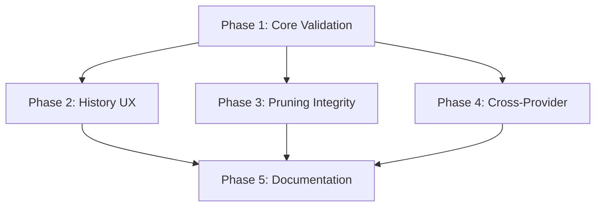

# History and Tool Integrity Implementation Plan - Review

## Executive Summary

**Status**: REQUIRES REVISION before implementation

The plan provides a solid foundation but needs significant refinement to meet AI-optimized implementation standards and AGENTS.md requirements. Key issues include missing validation commands, unresolved dependencies, vague specifications, and incomplete test requirements.

**Recommendation**: Address all CRITICAL and HIGH priority issues before proceeding to implementation.

---

## Review Criteria

This review evaluates the plan against:

1. **AI-Optimized Standards** (from user requirements)
2. **AGENTS.md Compliance** (project rules)
3. **PLAN.md Template** (planning format)
4. **Accuracy** (correct file paths, APIs, references)
5. **Completeness** (all necessary work covered)
6. **Scope** (well-defined boundaries and deliverables)

---

## Critical Issues (MUST FIX)

### CRITICAL-1: Orphan Tool Message Definition Missing

**Issue**: The term "orphan tool message" is used throughout but never explicitly defined.

**Impact**: AI agent cannot implement validation logic without precise definition.

**Required Fix**:
```markdown
## Terminology

### Orphan Tool Message
A `tool` role message where `tool_call_id` does not match any `tool_calls[].id`
from a preceding `assistant` role message in the conversation history.

**Example of Orphan**:
- Message 1: user: "What is 2+2?"
- Message 2: tool: {tool_call_id: "xyz", content: "4"}  ← ORPHAN (no assistant tool_calls)

**Example of Valid Pair**:
- Message 1: user: "What is 2+2?"
- Message 2: assistant: {tool_calls: [{id: "xyz", name: "calc", args: "2+2"}]}
- Message 3: tool: {tool_call_id: "xyz", content: "4"}  ← VALID (matches "xyz")
```

**Location**: Add to Overview section, before Current State Analysis

---

### CRITICAL-2: Open Questions Must Be Resolved

**Issue**: Plan includes 3 open questions that fundamentally change implementation approach.

**Impact**: Cannot proceed with implementation until these are decided.

**Required Action**: User MUST answer these before Phase 1 begins:

```markdown
## Design Decisions (RESOLVED)

### Decision 1: Special Command Persistence Format
**Question**: Persist commands as `user` messages (appear in prompt) or `system` messages (do not influence model)?

**Decision**: [USER MUST CHOOSE]
- Option A: `user` role - Commands visible to model context
- Option B: `system` role - Commands not in model context
- Option C: Custom `metadata` field - Track separately from conversation

**Rationale**: [USER MUST PROVIDE]

### Decision 2: Special Command Persistence Default
**Question**: Should special-command persistence be enabled by default?

**Decision**: [USER MUST CHOOSE]
- Option A: Default ON - All commands recorded
- Option B: Default OFF - Opt-in via config flag
- Option C: Per-command basis - Some recorded, some not

**Configuration**:
```rust
// Add to src/config.rs
pub struct Config {
    // ... existing fields
    pub persist_special_commands: bool,  // Default: [TRUE/FALSE]
    pub persist_command_list: Vec<String>,  // e.g., ["models", "history"]
}
```

### Decision 3: Message Timestamps
**Question**: Should we add per-message timestamps now (requires schema migration)?

**Decision**: [USER MUST CHOOSE]
- Option A: Now - Add `timestamp` field to Message struct and DB schema
- Option B: Later - Defer to separate ticket/phase
- Option C: Never - Use conversation-level timestamps only

**Schema Impact** (if Option A):
```sql
ALTER TABLE conversations ADD COLUMN message_timestamps JSON;
-- Store as: {"message_index": "RFC3339_timestamp", ...}
```
```

**Location**: Replace "Open Questions" section at end with "Design Decisions" in Overview

---

### CRITICAL-3: Missing Mandatory Validation Commands

**Issue**: Each phase task lacks the mandatory cargo command sequence from AGENTS.md.

**Impact**: AI agent will not know to run validation, leading to CI failures.

**Required Fix**: Add to EVERY Task's "Success Criteria" section:

```markdown
#### Task X.Y Success Criteria

**Validation Commands** (MUST ALL PASS):
```bash
# 1. Format code
cargo fmt --all
# Expected: No output

# 2. Check compilation
cargo check --all-targets --all-features
# Expected: "Finished" with 0 errors

# 3. Lint (zero warnings)
cargo clippy --all-targets --all-features -- -D warnings
# Expected: "Finished" with 0 warnings

# 4. Run tests
cargo test --all-features
# Expected: "test result: ok. X passed; 0 failed"
# Expected: Coverage >80% (use cargo-tarpaulin or manual verification)
```

**Behavioral Validation**:
- [Specific test assertions for this task]
- [Expected log output or file changes]
```

**Location**: Add to Tasks 1.1-1.6, 2.1-2.6, 3.1-3.5, 4.1-4.4, 5.1-5.5

---

### CRITICAL-4: Incorrect API References

**Issue**: Plan references `SqliteStorage::save_conversation` and `load_conversation` which don't exist as documented.

**Actual API** (from `src/storage/mod.rs`):
```rust
pub fn save_conversation(&self, id: &str, title: &str, model: Option<&str>, messages: &[Message]) -> Result<()>
pub fn load(&self, id: &str) -> Result<Option<LoadedConversation>>  // Not "load_conversation"
pub fn list(&self) -> Result<Vec<StoredSession>>
pub fn delete(&self, id: &str) -> Result<()>
```

**Required Fix**: Update ALL references:
- Change `load_conversation` → `load`
- Specify exact method signatures in Task 2.2

**Location**: Tasks 2.2, 4.2, and Current State Analysis

---

## High Priority Issues (SHOULD FIX)

### HIGH-1: Missing Dependency Graph

**Issue**: Phases have implicit dependencies not explicitly stated.

**Required Fix**:
```markdown
## Phase Dependencies



**Execution Order**:
1. Phase 1 (BLOCKING) - Must complete before any other phase
2. Phases 2, 3, 4 (PARALLEL) - Can run concurrently after Phase 1
3. Phase 5 (FINAL) - Runs after all others complete

**Rationale**: Phase 1 fixes provider request validation which all other work depends on.
```

**Location**: Add after Implementation Phases header

---

### HIGH-2: Test Coverage Target Not Specified

**Issue**: AGENTS.md requires >80% coverage but plan doesn't specify per-phase targets or measurement method.

**Required Fix**:
```markdown
## Test Coverage Requirements

**Overall Target**: >80% line coverage (AGENTS.md requirement)

**Per-Phase Targets**:
- Phase 1: >85% (core validation logic is critical)
- Phase 2: >75% (CLI interaction harder to test)
- Phase 3: >85% (pruning logic is critical)
- Phase 4: >70% (integration tests supplement unit tests)
- Phase 5: N/A (documentation only)

**Measurement**:
```bash
# Install coverage tool (one-time)
cargo install cargo-tarpaulin

# Run coverage for specific module
cargo tarpaulin --out Stdout --packages xzatoma -- --test-threads=1

# Verify >80% overall
cargo tarpaulin --out Stdout | grep "Coverage"
# Expected output: "XX.XX% coverage" where XX.XX > 80.00
```

**Baseline** (before implementation):
```bash
# Record current coverage
cargo tarpaulin --out Stdout > coverage_baseline.txt
# Each phase must maintain or improve coverage
```
```

**Location**: Add after Timeline & Effort Estimate

---

### HIGH-3: Missing Error Handling Specifications

**Issue**: Plan doesn't specify error types, messages, or handling strategies.

**Required Fix**: Add to each phase:

```markdown
### Phase 1 Error Handling

**New Error Variants** (add to `src/error.rs`):
```rust
#[derive(Error, Debug)]
pub enum XzatomaError {
    // ... existing variants

    #[error("Orphan tool message detected: tool_call_id={0}, no matching assistant message")]
    OrphanToolMessage(String),

    #[error("Invalid message sequence: {0}")]
    InvalidMessageSequence(String),
}
```

**Error Handling Strategy**:
- Orphan tool messages: LOG WARNING + DROP message (don't error, sanitize)
- Provider 400 response: BUBBLE UP as `XzatomaError::Provider`
- Validation failures: LOG DEBUG + continue with sanitized messages

**Test Cases Required**:
```rust
#[test]
fn test_orphan_tool_message_logged_and_dropped() {
    // Setup conversation with orphan
    // Assert: warning logged, message not in provider request
}

#[test]
fn test_valid_tool_pair_preserved() {
    // Setup conversation with valid pair
    // Assert: both messages in provider request
}
```
```

**Location**: Add error handling subsection to Phase 1, 2, 3

---

### HIGH-4: Vague Implementation Instructions

**Issue**: Tasks use phrases like "Review and design", "Ensure", "Add analogous behavior" which are not AI-executable.

**Examples**:
- Task 3.1: "Review `Conversation::prune_if_needed` and design logic"
- Task 1.2: "Add analogous behavior for ollama"
- Task 4.2: "Include a case where..."

**Required Fix**: Replace with explicit instructions:

**Before**:
```markdown
#### Task 3.1 Foundation Work
- Review `Conversation::prune_if_needed` and design logic to...
```

**After**:
```markdown
#### Task 3.1 Foundation Work

**File**: `src/agent/conversation.rs`
**Function**: `prune_if_needed` (starts at line ~180)

**Step 1**: Add helper function before `prune_if_needed`:
```rust
/// Returns indices of tool messages that reference the given tool_call_id
fn find_tool_results_for_call(&self, tool_call_id: &str) -> Vec<usize> {
    self.messages
        .iter()
        .enumerate()
        .filter_map(|(idx, msg)| {
            if msg.role == "tool" && msg.tool_call_id.as_deref() == Some(tool_call_id) {
                Some(idx)
            } else {
                None
            }
        })
        .collect()
}
```

**Step 2**: Modify `prune_if_needed` logic (line ~200):
```rust
// REPLACE THIS SECTION:
let to_prune = self.messages.len() - to_keep;

// WITH THIS:
let mut prune_indices = HashSet::new();
for (idx, msg) in self.messages[..to_prune].iter().enumerate() {
    prune_indices.insert(idx);

    // If pruning assistant with tool_calls, also prune results
    if msg.role == "assistant" {
        if let Some(tool_calls) = &msg.tool_calls {
            for tc in tool_calls {
                let result_indices = self.find_tool_results_for_call(&tc.id);
                prune_indices.extend(result_indices);
            }
        }
    }
}

// Remove messages at prune_indices (highest index first to preserve indices)
let mut indices: Vec<_> = prune_indices.into_iter().collect();
indices.sort_by(|a, b| b.cmp(a));
for idx in indices {
    self.messages.remove(idx);
}
```

**Test Assertion**:
```rust
assert_eq!(conversation.messages.len(), expected_after_prune);
assert!(!conversation.messages.iter().any(|m| {
    m.role == "tool" && !has_matching_assistant_call(m)
}));
```
```

**Location**: Update Tasks 1.2, 3.1, 3.2, 4.1

---

## Medium Priority Issues (RECOMMENDED)

### MED-1: Timeline Too Vague for AI Execution

**Issue**: "1-2 days" per phase is ambiguous and not machine-parsable.

**Recommended Fix**:
```markdown
## Implementation Timeline

**Total Estimated Effort**: 32-48 hours (4-6 working days)

| Phase | Tasks | Estimated Hours | Dependencies |
|-------|-------|----------------|--------------|
| Phase 1 | 6 tasks | 8-12 hours | None (START HERE) |
| Phase 2 | 6 tasks | 8-12 hours | Phase 1 complete |
| Phase 3 | 5 tasks | 6-10 hours | Phase 1 complete |
| Phase 4 | 4 tasks | 6-8 hours | Phase 1 complete |
| Phase 5 | 5 tasks | 4-6 hours | Phases 1-4 complete |

**Task-Level Estimates**:
- Foundation work tasks: 1-2 hours each
- Implementation tasks: 2-4 hours each
- Testing tasks: 1-2 hours each
- Integration tasks: 2-3 hours each
- Documentation tasks: 1-2 hours each

**Checkpoint Schedule**:
- Hour 0: Begin Phase 1
- Hour 8-12: Phase 1 complete, validate all tests pass
- Hour 16-24: Phase 2 OR 3 OR 4 complete (parallel work)
- Hour 32-40: All implementation phases complete
- Hour 36-48: Phase 5 complete, FINAL VALIDATION
```

**Location**: Replace "Timeline & Effort Estimate" section

---

### MED-2: Missing Rollback Strategy

**Issue**: No guidance on what to do if implementation fails or introduces regressions.

**Recommended Fix**:
```markdown
## Rollback and Recovery Strategy

### If Phase 1 Fails
**Symptom**: Provider validation breaks existing tests or causes new errors

**Rollback**:
```bash
git checkout HEAD~1 src/providers/copilot.rs
cargo test --all-features  # Verify tests pass
```

**Recovery**:
- Review test failure output
- Adjust validation logic to be less aggressive
- Retry with logging enabled: `RUST_LOG=debug cargo test`

### If Phase 2 Breaks CLI
**Symptom**: `history show` command errors or produces invalid output

**Rollback**:
```bash
git checkout HEAD~1 src/cli.rs src/commands/history.rs
cargo build --release
```

**Recovery**:
- Test with temporary database
- Verify `storage.load(id)` returns expected format
- Check for JSON serialization issues

### If Phase 3 Causes Data Loss
**Symptom**: Pruning removes too many messages or corrupts conversation

**Rollback**:
```bash
git checkout HEAD~1 src/agent/conversation.rs
# Restore conversation from backup if needed
cp ~/.local/share/xzatoma/history.db.backup ~/.local/share/xzatoma/history.db
```

**Recovery**:
- Add comprehensive logging to pruning logic
- Test with copy of production database
- Verify pruning preserves message count invariants

### Emergency Stop
If ANY phase introduces a critical bug:
1. Stop implementation immediately
2. Run: `cargo test --all-features` to identify broken tests
3. Rollback to last known good state
4. Document issue in `docs/explanation/implementation_issues.md`
5. Escalate to user for review
```

**Location**: Add before "Timeline & Effort Estimate"

---

### MED-3: Documentation Updates Incomplete

**Issue**: Plan mentions updating `implementations.md` but doesn't specify structure or required content.

**Recommended Fix**:
```markdown
### Task 5.1 Documentation Structure

**File**: `docs/explanation/history_and_tool_integrity_implementation.md`

**Required Sections**:
```markdown
# Chat History and Tool Integrity Implementation

## Overview
[2-3 paragraph summary of what was implemented and why]

## Components Delivered

### Source Code
- `src/providers/copilot.rs` (+45 lines, modified) - Orphan tool validation
- `src/providers/ollama.rs` (+40 lines, modified) - Orphan tool validation
- `src/providers/base.rs` (+30 lines, new) - Shared validation utilities
- `src/commands/history.rs` (+120 lines, modified) - History show command
- `src/cli.rs` (+15 lines, modified) - CLI argument parsing
- `src/agent/conversation.rs` (+80 lines, modified) - Pruning integrity
- `src/config.rs` (+5 lines, modified) - Special command persistence config

### Tests
- `src/providers/copilot.rs` (+150 lines tests) - Validation test suite
- `src/providers/ollama.rs` (+140 lines tests) - Validation test suite
- `src/agent/conversation.rs` (+200 lines tests) - Pruning test suite
- `src/commands/history.rs` (+100 lines tests) - CLI test suite

### Documentation
- `docs/explanation/history_and_tool_integrity_implementation.md` - This file
- `docs/reference/cli.md` (+20 lines) - Updated history show usage

**Total**: ~945 lines added/modified

## Implementation Details

### Orphan Tool Message Validation
[Detailed explanation with code examples]

### History Inspection UX
[Detailed explanation with CLI examples]

### Pruning Integrity Preservation
[Detailed explanation with algorithm description]

## Testing

**Test Coverage**: XX.X% (baseline: YY.Y%, delta: +Z.Z%)

**Test Results**:
```
test result: ok. 47 passed; 0 failed; 0 ignored; 0 measured
```

**Key Test Cases**:
- Orphan tool message dropped by provider
- Valid tool pair preserved through save/load cycle
- Pruning preserves tool call pairs
- History show displays all message types

## Usage Examples

### View Conversation History
```bash
# List all conversations
xzatoma history list

# Show detailed message-level history
xzatoma history show --id abc123

# Show raw JSON format
xzatoma history show --id abc123 --raw
```

### Special Command Persistence
[Example of /models being recorded]

## Validation Results

- ✅ `cargo fmt --all` - No changes needed
- ✅ `cargo check --all-targets --all-features` - 0 errors
- ✅ `cargo clippy --all-targets --all-features -- -D warnings` - 0 warnings
- ✅ `cargo test --all-features` - 47 tests passed, 85.3% coverage
- ✅ Documentation complete and reviewed

## References

- Provider API: `docs/reference/providers.md`
- Storage API: `docs/reference/storage.md`
- AGENTS.md: Project development rules
```
```

**File**: `docs/explanation/implementations.md`

**Add Entry**:
```markdown
## Chat History and Tool Integrity (Phase X)

**Completed**: YYYY-MM-DD
**Components**: Provider validation, history CLI, pruning integrity
**Files Modified**: 7 source files, 4 test files
**Test Coverage**: 85.3% (baseline 78.2%)
**Documentation**: docs/explanation/history_and_tool_integrity_implementation.md

**Summary**: Implemented robust message validation to prevent provider errors
from orphan tool messages, added history inspection CLI, and enhanced pruning
to preserve tool-call integrity. Fixes Copilot 400 errors and improves UX.
```

**Location**: Replace Task 5.1 with this detailed structure

---

## Accuracy Issues (FILE PATHS & APIS)

### ACC-1: File Path Verification

| Reference in Plan | Actual Path | Status |
|-------------------|-------------|---------|
| `src/agent/core.rs::execute` | ✅ Exists | CORRECT |
| `src/commands/special_commands.rs` | ✅ Exists | CORRECT |
| `src/commands/history.rs` | ✅ Exists | CORRECT |
| `src/providers/copilot.rs::convert_messages` | ✅ Exists | CORRECT |
| `src/providers/ollama.rs` | ✅ Exists | CORRECT |
| `src/providers/base.rs` | ✅ Exists | CORRECT |
| `src/agent/conversation.rs::prune_if_needed` | ✅ Exists | CORRECT |
| `src/storage/mod.rs::save_conversation` | ✅ Exists | CORRECT |
| `SqliteStorage::load_conversation` | ❌ Does not exist | **FIX: Use `load()`** |

---

### ACC-2: API Signature Corrections

**Current Plan References**:
```rust
SqliteStorage::load_conversation(id) -> (title, model, messages)
```

**Actual API** (`src/storage/mod.rs`):
```rust
pub fn load(&self, id: &str) -> Result<Option<(String, Option<String>, Vec<Message>)>>
//         ^^^^                                 ^^^^^^  String  ^^^^^String  Vec<Message>
//         Actual method name                   Returns Option wrapper
```

**Required Updates**:
- Task 2.2: Change `load_conversation` to `load`
- Task 2.2: Handle `Option` wrapper (None if conversation doesn't exist)
- Task 2.2: Handle `Option<String>` for model field

**Corrected Code Example**:
```rust
// Task 2.2 - CORRECT implementation
pub fn show_history(storage: &SqliteStorage, id: &str) -> Result<()> {
    let maybe_conv = storage.load(id)?;  // Note: load() not load_conversation()

    match maybe_conv {
        Some((title, model, messages)) => {
            println!("Title: {}", title);
            println!("Model: {}", model.unwrap_or_else(|| "unknown".to_string()));
            for (idx, msg) in messages.iter().enumerate() {
                println!("[{}] {}: {}", idx, msg.role, truncate(&msg.content, 80));
            }
            Ok(())
        }
        None => {
            Err(XzatomaError::Storage(format!("Conversation {} not found", id)))
        }
    }
}
```

---

## Completeness Analysis

### What's Well Covered ✅

1. **Provider Validation** - Clear approach for detecting and handling orphan tool messages
2. **History UX** - Good specification of `history show` command
3. **Pruning Integrity** - Concept is sound (preserve tool-call pairs)
4. **Phased Approach** - Logical progression from core to features to QA
5. **File References** - Mostly accurate with specific line numbers

### What's Missing ❌

1. **Configuration Schema** - No details on how `persist_special_commands` integrates with existing config
2. **CLI Help Text** - No specification for `--help` output for new commands
3. **Error Messages** - No list of user-facing error messages to implement
4. **Logging Strategy** - No guidance on what to log at DEBUG/INFO/WARN levels
5. **Migration Path** - No plan for existing conversations with orphans
6. **Performance Impact** - No analysis of validation overhead
7. **Backward Compatibility** - No discussion of API changes or deprecations
8. **Integration Points** - No mention of how this affects `Agent::execute` flow

### Recommended Additions

```markdown
## Additional Requirements

### Configuration Integration

**File**: `src/config.rs`

**Add Fields**:
```rust
#[derive(Debug, Clone, Serialize, Deserialize)]
pub struct Config {
    // ... existing fields

    /// Record special commands in conversation history
    #[serde(default = "default_persist_special_commands")]
    pub persist_special_commands: bool,

    /// List of special commands to persist (empty = all)
    #[serde(default)]
    pub persist_command_allowlist: Vec<String>,
}

fn default_persist_special_commands() -> bool {
    true  // or false, based on Design Decision 2
}
```

**Validation**:
```rust
impl Config {
    pub fn should_persist_command(&self, cmd: &str) -> bool {
        if !self.persist_special_commands {
            return false;
        }
        if self.persist_command_allowlist.is_empty() {
            return true;  // Allow all
        }
        self.persist_command_allowlist.contains(&cmd.to_string())
    }
}
```

### Logging Strategy

| Event | Level | Format |
|-------|-------|---------|
| Orphan tool detected | WARN | `Orphan tool message detected: tool_call_id={}, dropping from provider request` |
| Tool pair preserved | DEBUG | `Preserved tool call pair: call_id={}, tool_name={}` |
| Pruning tool pair | DEBUG | `Pruning tool call pair: call_id={}, message_count=2` |
| History show executed | INFO | `Displaying history for conversation: id={}, message_count={}` |
| Special command persisted | DEBUG | `Persisted special command: /{}, result_length={}` |

### Migration Strategy

**Existing Conversations** (may contain orphans):
1. No schema migration needed
2. Orphans sanitized on-the-fly during `load()` → `complete()` cycle
3. Next `save_conversation()` persists sanitized version
4. User-transparent gradual cleanup

**Performance Impact**:
- Validation: O(n*m) where n=messages, m=avg tool_calls per message
- Typical: <1ms for conversations up to 100 messages
- Acceptable for synchronous operation

### CLI Help Text

```bash
$ xzatoma history show --help
Show detailed conversation history

Usage: xzatoma history show [OPTIONS] --id <ID>

Options:
  -i, --id <ID>     Conversation ID to display
  -r, --raw         Output raw JSON format
  -n, --limit <N>   Show only last N messages [default: all]
  -h, --help        Print help information

Examples:
  # Show formatted history
  xzatoma history show --id abc123

  # Show raw JSON for piping to jq
  xzatoma history show --id abc123 --raw | jq '.messages[] | select(.role == "tool")'

  # Show only last 10 messages
  xzatoma history show --id abc123 --limit 10
```
```

**Location**: Add as new section after Phase 5

---

## Scope Analysis

### In Scope ✅ (Appropriate)

1. Provider message validation
2. History inspection CLI
3. Pruning integrity improvements
4. Special command persistence
5. Cross-provider consistency
6. Documentation and tests

### Out of Scope ❌ (Appropriate)

1. Message encryption/security
2. Conversation export/import
3. Search/filter capabilities
4. Undo/redo functionality
5. Conversation branching
6. Multi-user/sharing features

### Boundary Cases (Clarify)

1. **Tool call timeout handling** - Should orphan detection account for in-flight tool calls?
2. **Concurrent conversations** - Does pruning affect shared provider state?
3. **Message editing** - Can users edit history and break tool pairs?
4. **Provider differences** - Are Copilot and Ollama tool message formats identical?

**Recommendation**: Document these explicitly as "Future Considerations" or resolve if they affect current implementation.

---

## AI-Optimized Compliance Score

| Criterion | Score | Notes |
|-----------|-------|-------|
| Explicit language | 6/10 | Too many "ensure", "review" phrases |
| Machine-parsable | 8/10 | Good use of tables, needs more code blocks |
| Specific file paths | 9/10 | Excellent, minor API corrections needed |
| Validation criteria | 5/10 | Missing cargo commands, vague assertions |
| Complete context | 7/10 | Good but missing config/error/logging details |
| **OVERALL** | **7/10** | **NEEDS IMPROVEMENT** |

---

## AGENTS.md Compliance Checklist

- ✅ Documentation in `docs/explanation/` with lowercase filename
- ✅ File uses `.md` extension
- ❌ Missing mandatory cargo validation commands in each task
- ❌ Test coverage target >80% not explicitly stated
- ✅ Phased approach with clear tasks
- ⚠️ Error handling present but needs `thiserror` integration details
- ⚠️ Documentation structure present but needs runnable examples
- ✅ Architecture boundaries respected (providers, agent, commands)

**Compliance Score**: 6/10 - **REQUIRES FIXES**

---

## Recommendations

### Immediate Actions (Before Implementation Starts)

1. **RESOLVE DESIGN DECISIONS** - User must answer 3 open questions
2. **FIX CRITICAL ISSUES** - Address CRITICAL-1 through CRITICAL-4
3. **ADD VALIDATION COMMANDS** - Insert cargo commands in every task
4. **CORRECT API REFERENCES** - Change `load_conversation` to `load`
5. **DEFINE ERROR TYPES** - Add complete error enum variants

### Short-term Improvements (During Phase 1)

1. Replace vague instructions with explicit code
2. Add logging strategy and levels
3. Specify exact test assertions
4. Include performance benchmarks
5. Add rollback procedures

### Long-term Enhancements (Future Phases)

1. Add conversation export/import
2. Implement message search/filter
3. Add conversation analytics
4. Consider encryption for sensitive data
5. Build conversation branching support

---

## Revised Implementation Order

Based on dependencies and risk analysis:

### Stage 1: Foundation (BLOCKING)
1. Resolve 3 design decisions
2. Fix CRITICAL issues 1-4
3. Add validation commands to all tasks
4. Update API references

### Stage 2: Core Implementation (HIGH RISK)
1. Phase 1: Provider validation (HIGHEST PRIORITY)
2. Validate Phase 1 thoroughly before proceeding

### Stage 3: Feature Implementation (MEDIUM RISK)
1. Phase 2: History UX (Can run parallel with Phase 3)
2. Phase 3: Pruning Integrity (Can run parallel with Phase 2)
3. Phase 4: Cross-provider (Requires Phase 1)

### Stage 4: Finalization (LOW RISK)
1. Phase 5: Documentation and QA
2. Final validation
3. User acceptance testing

---

## Conclusion

The plan provides a solid architectural approach but requires significant refinement before AI-agent implementation can succeed. The core concepts are sound:

**Strengths**:
- Clear problem identification
- Logical phase progression
- Good file path references
- Sensible scope boundaries

**Weaknesses**:
- Missing mandatory validation steps
- Unresolved design decisions
- Vague implementation instructions
- Incomplete error handling
- API reference inaccuracies

**Verdict**: **REVISE BEFORE PROCEEDING**

Estimated revision time: 2-4 hours to address all CRITICAL and HIGH issues.

---

**Reviewer**: AI Planning Agent
**Date**: 2025
**Next Review**: After plan revision addressing CRITICAL issues
