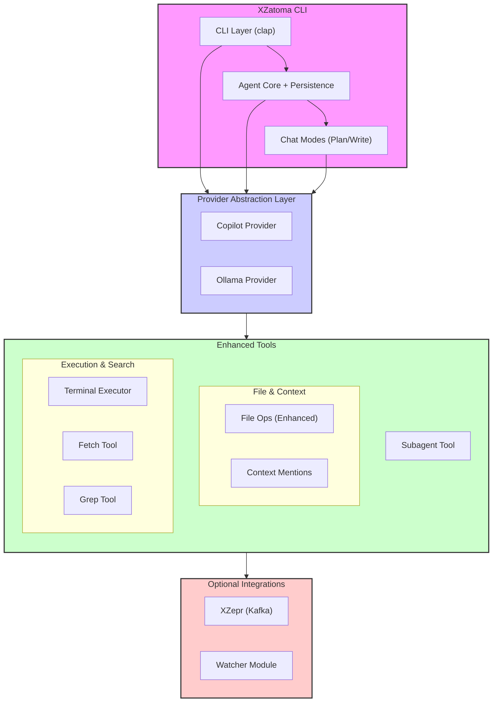
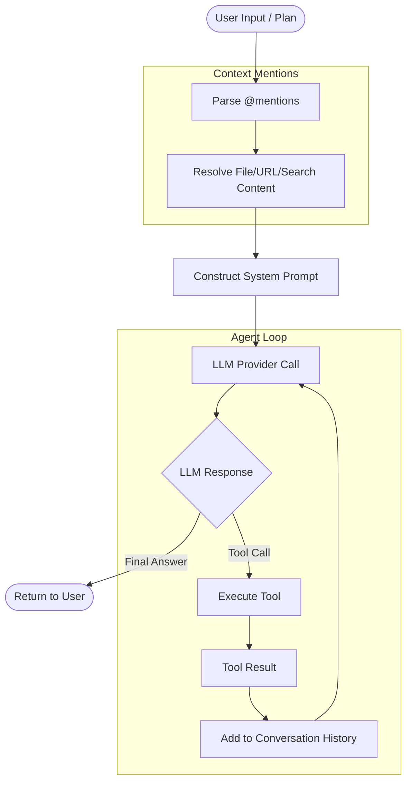

# XZatoma Architecture

## Overview

XZatoma is a simple autonomous AI agent CLI written in Rust that can execute tasks through conversation with AI providers (GitHub Copilot or Ollama). It provides basic file system and terminal tools, allowing the AI to accomplish tasks by using these generic capabilities rather than specialized features.

Think of it as a command-line version of Zed's agent chat - you give it a goal (via interactive prompt or structured plan), and it uses basic tools to accomplish it.

## System Architecture

### High-Level Architecture



## Core Components

### 1. CLI Layer

**Purpose**: User interface and input handling

**Responsibilities**:

- Parse command-line arguments
- Load plan files (JSON, YAML, Markdown)
- Start interactive chat mode
- Display agent responses and tool usage
- Handle configuration

**Key Modules**:

- `cli.rs` - CLI parser using `clap`
- `config.rs` - Configuration management

**Usage Modes**:

```bash
# Interactive mode
xzatoma chat

# Execute a plan
xzatoma run --plan task.yaml

# One-shot prompt
xzatoma run --prompt "List all Rust files and count lines"
```

### 2. Agent Core

**Purpose**: Autonomous execution loop with AI provider

**Responsibilities**:

- Manage conversation with AI provider
- Execute tool calls returned by AI
- Add tool results back to conversation
- Continue until task complete
- Handle errors and retries

**Key Modules**:

- `agent/mod.rs` - Main agent
- `agent/conversation.rs` - Message history
- `agent/executor.rs` - Tool execution

**Execution Loop**:



1. User provides goal/instruction
2. Agent sends conversation to AI provider
3. AI responds with:
   - Tool call → Execute tool → Add result → Loop to step 2
   - Final answer → Return to user
4. Done

**Architecture Pattern**:

```rust
pub struct Agent {
  provider: Arc<dyn Provider>,
  conversation: Conversation,
  tools: Vec<Tool>,
  max_iterations: usize,
}

impl Agent {
  pub async fn execute(&mut self, instruction: String) -> Result<String> {
    self.conversation.add_user_message(instruction);

    let mut iterations = 0;

    loop {
      // Enforce iteration limit to prevent infinite loops
      if iterations >= self.max_iterations {
        return Err(XzatomaError::MaxIterationsExceeded {
          limit: self.max_iterations,
          message: "Agent exceeded maximum iteration limit".to_string(),
        });
      }
      iterations += 1;

      let response = self.provider.complete(
        &self.conversation.messages(),
        &self.tools
      ).await?;

      if let Some(tool_calls) = response.tool_calls {
        for call in tool_calls {
          let result = self.execute_tool(&call).await?;
          self.conversation.add_tool_result(result);
        }
      } else {
        return Ok(response.content);
      }
    }
  }
}
```

**Iteration Limits**:

The agent enforces a maximum iteration limit (configured via `agent.max_turns`, default: 100) to prevent infinite loops where the AI continuously calls tools without reaching a conclusion. When the limit is exceeded, the agent returns an error to the user.

### 2.5. Conversation Management

**Purpose**: Manage conversation history and token limits

**Responsibilities**:

- Track conversation messages
- Count approximate tokens
- Prune old messages when approaching limits
- Preserve essential context

**Key Modules**:

- `agent/conversation.rs` - Conversation history and token management

**Token Limits by Provider**:

<<<<<<< Updated upstream
| Provider | Model       | Context Window | Safe Limit (80%) |
| -------- | ----------- | -------------- | ---------------- |
| Copilot  | gpt-5-mini  | 128,000 tokens | 102,400 tokens   |
| Copilot  | gpt-4o-mini | 128,000 tokens | 102,400 tokens   |
| Ollama   | qwen3       | 32,768 tokens  | 26,214 tokens    |
| Ollama   | llama3      | 8,192 tokens   | 6,553 tokens     |
=======
| Provider | Model            | Context Window | Safe Limit (80%) |
| -------- | ---------------- | -------------- | ---------------- |
| Copilot  | gpt-5.3-codex       | 264,000 tokens | 211,200 tokens   |
| Copilot  | gpt-5.1-codex-mini | 200,000 tokens | 160,000 tokens   |
| Ollama   | llama3.2:3b      | 131,072 tokens | 104,857 tokens   |
| Ollama   | granite3.2:2b    | 131,072 tokens | 104,857 tokens   |
>>>>>>> Stashed changes

**Pruning Strategy**:

When conversation approaches token limit:

1. **Always Retain**:

- System message (tool definitions)
- Original user instruction
- Last 5 turns of conversation

2. **Prune in Order**:

- Oldest tool call/result pairs first
- Keep most recent tool results (more relevant)
- Summarize pruned content in special message

3. **Pruning Example**:

```
[PRUNED: 15 tool calls between turn 3-18. Summary: Listed files, read configuration, searched for TODO comments]
```

**Implementation Pattern**:

```rust
pub struct Conversation {
  messages: Vec<Message>,
  token_count: usize,
  max_tokens: usize,
  min_retain_turns: usize,
}

impl Conversation {
  pub fn add_user_message(&mut self, content: String) {
    let message = Message::user(content);
    self.messages.push(message);
    self.update_token_count();
    self.prune_if_needed();
  }

  pub fn add_assistant_message(&mut self, content: String, tool_calls: Option<Vec<ToolCall>>) {
    let message = Message::assistant(content, tool_calls);
    self.messages.push(message);
    self.update_token_count();
    self.prune_if_needed();
  }

  pub fn add_tool_result(&mut self, tool_call_id: String, result: String) {
    let message = Message::tool_result(tool_call_id, result);
    self.messages.push(message);
    self.update_token_count();
    self.prune_if_needed();
  }

  fn update_token_count(&mut self) {
    // Approximate: 1 token ≈ 4 characters
    self.token_count = self.messages.iter()
      .map(|m| m.content.len() / 4)
      .sum();
  }

  fn prune_if_needed(&mut self) {
    if self.token_count <= self.max_tokens {
      return;
    }

    // Find pruneable range (between system message and last N turns)
    let system_end = 1; // First message is system
    let recent_start = self.messages.len().saturating_sub(self.min_retain_turns * 2);

    if recent_start <= system_end {
      // Can't prune enough - return error to user
      return;
    }

    // Create summary of pruned section
    let pruned = &self.messages[system_end..recent_start];
    let summary = self.create_summary(pruned);

    // Remove pruned messages and add summary
    self.messages.drain(system_end..recent_start);
    self.messages.insert(system_end, Message::system(format!(
      "[CONTEXT PRUNED: {}]", summary
    )));

    self.update_token_count();
  }

  fn create_summary(&self, messages: &[Message]) -> String {
    let tool_calls: Vec<_> = messages.iter()
      .filter_map(|m| m.tool_call.as_ref())
      .map(|tc| tc.function.name.as_str())
      .collect();

    format!(
      "{} turns with {} tool calls: {}",
      messages.len(),
      tool_calls.len(),
      tool_calls.join(", ")
    )
  }

  pub fn messages(&self) -> &[Message] {
    &self.messages
  }

  pub fn token_count(&self) -> usize {
    self.token_count
  }
}
```

```yaml
agent:
  max_turns: 100
  conversation:
    max_tokens: 100000 # Provider-specific limit
    min_retain_turns: 5 # Always keep last N turns
    prune_threshold: 0.8 # Prune when 80% of max_tokens
```

### 2.6. Chat Modes System

**Purpose**: Fine-grained control over agent capabilities and safety

**Responsibilities**:

- Define what tools are available (read-only vs read/write)
- Control confirmation requirements for dangerous operations
- Preserve conversation across mode switches
- Guide agent behavior through mode-specific prompts

**Key Modules**:

- `chat_mode.rs` - ChatMode and SafetyMode enums
- `commands/chat_mode.rs` - Mode switching logic
- `tools/registry_builder.rs` - Mode-aware tool filtering
- `prompts/` - Mode-specific system prompts

**Chat Modes**:

```rust
pub enum ChatMode {
  Planning, // Read-only analysis and planning
  Write,   // Full read/write access
}

pub enum SafetyMode {
  AlwaysConfirm, // Confirm dangerous operations
  NeverConfirm,  // Execute without confirmation (YOLO mode)
}
```

**Mode Characteristics**:

| Aspect | Planning Mode | Write Mode |
| Aspect | Planning Mode | Write Mode |
| :--------------- | :------------------------------ | :------------------------ |
| Read files | ✓ | ✓ |
| Write files | ✗ | ✓ |
| Delete files | ✗ | ✓ |
| Terminal access | ✗ | ✓ |
| Typical use case | Analysis, exploration, creation | Implementation, execution |

**Tool Registry Filtering**:

```text
┌── Agent ──┐   ┌─ Tool Registry ─┐
│           │   │                 │
│  ChatMode ├─► │  Tool Filtering ├─► [Available Tools]
│           │   │                 │
└───────────┘   └─────────────────┘
```

**Filtering**:

```rust
impl ToolRegistryBuilder {
  pub fn build_for_planning(&self) -> ToolRegistry {
    // Only read-only tools available
    // - list_directory, read_file, grep, fetch
    // - BLOCKED: write_file, edit_file, delete_path, terminal
  }

  pub fn build_for_write(&self) -> ToolRegistry {
    // All tools available
    // Safety mode controls confirmation requirements
  }
}
```

**Mode Switching**:

Users can switch modes mid-conversation with full conversation preservation:

```text
[PLANNING][SAFE] >> /mode write
Switched to WRITE mode. All tools now available.

[WRITE][SAFE] >> /yolo
Switched to YOLO safety mode. Operations will execute without confirmation.

[WRITE][YOLO] >>
```

**Benefits**:

- **Safety**: Planning mode is inherently safe for exploration
- **Flexibility**: Switch modes as workflow evolves
- **Context preservation**: Conversation history retained across switches
- **Clear visibility**: Prompt indicator shows current mode at all times

For detailed information, see [Chat Modes Architecture](../explanation/chat_modes_architecture.md).

### 2.7. Context Mention System

**Purpose**: Seamless injection of file contents, search results, and web content into agent prompts

**Responsibilities**:

- Parse `@mention` patterns from user input
- Load content from various sources (files, searches, URLs)
- Augment prompts with loaded content
- Handle errors gracefully
- Prevent security issues (SSRF, path traversal)

**Key Modules**:

- `mention_parser.rs` - Mention parsing and content loading
- `tools/fetch.rs` - HTTP fetching with security validation
- `tools/grep.rs` - Content search across files

**Mention Types**:

```rust
pub enum Mention {
  File(FileMention),   // @config.yaml#L10-20
  Search(SearchMention), // @search:"pattern"
  Grep(GrepMention),   // @grep:"regex"
  Url(UrlMention),    // @url:https://example.com
}
```

**Usage Examples**:

```text
User: Review @src/config.rs and check for @search:"TODO"

Agent receives augmented prompt with:
- Full contents of src/config.rs
- Search results showing all TODO comments
```

**Content Injection Pipeline**:

```text
1. Parse user input → Extract @mentions
2. For each mention:
   - Resolve path/URL
   - Load content
   - Apply filters (line ranges, etc.)
3. Augment original prompt with content
4. Send to AI provider
```

**Security Features**:

- **SSRF Prevention**: Blocks private IPs (10.0.0.0/8, 192.168.0.0/16, 127.0.0.1)
- **Path Validation**: Prevents `..` traversal beyond working directory
- **Rate Limiting**: Per-domain limits on URL fetches
- **Size Limits**: 10 MB max for files, 1 MB max for fetched URLs
- **Timeouts**: 60-second timeout per HTTP request

**Caching**:

- **File content**: Cached for session duration
- **URL content**: Cached for 24 hours
- **Search results**: Not cached (always fresh)

**Error Handling**:

When mention loading fails, execution continues with placeholder:

```text
Failed to include @nonexistent.rs:

<file not found>

Suggestion: Check path or use full path: src/nonexistent.rs
```

For detailed information, see [Context Mention Architecture](../explanation/context_mention_architecture.md).

### 2.8. Conversation Persistence

**Purpose**: Store and retrieve conversation history for debugging and replay

**Responsibilities**:

- Persist subagent conversations to embedded database
- Generate unique conversation IDs (ULIDs)
- Link parent-child conversations
- Support conversation replay and analysis

**Key Modules**:

- `agent/persistence.rs` - ConversationStore implementation
- `storage/` - Storage types and abstractions

**Storage Architecture**:

```rust
pub struct ConversationStore {
  db: sled::Db, // Embedded key-value database
}

pub struct ConversationRecord {
  pub id: String,        // ULID
  pub parent_id: Option<String>, // For subagent chains
  pub label: String,
  pub depth: usize,
  pub messages: Vec<Message>,
  pub metadata: ConversationMetadata,
  pub started_at: String,   // RFC-3339 timestamp
  pub completed_at: Option<String>,
}
```

**Features**:

- **ULID IDs**: Sortable by timestamp for easy querying
- **Parent-child linking**: Reconstruct subagent conversation trees
- **Metadata tracking**: Turns, tokens, allowed tools, completion status
- **RFC-3339 timestamps**: Standard time format for analysis

**Database Location**: `~/.xzatoma/conversations.db`

**Use Cases**:

- Debug subagent execution failures
- Replay conversations to understand decisions
- Analyze token usage and performance
- Audit agent actions

### 2.9. Metrics and Quota Management

**Purpose**: Track performance and enforce resource limits

**Responsibilities**:

- Record subagent execution metrics (duration, tokens, turns)
- Enforce quota limits (max executions, tokens, time)
- Export metrics to Prometheus (optional)
- Provide real-time quota visibility

**Key Modules**:

- `agent/metrics.rs` - SubagentMetrics implementation
- `agent/quota.rs` - QuotaTracker implementation

**Metrics Collection**:

```rust
pub struct SubagentMetrics {
  label: String,
  depth: usize,
  start_time: Instant,
  recorded: Cell<bool>,
}

impl SubagentMetrics {
  pub fn record_completion(&self, turns: usize, tokens: usize, status: &str) {
    // Records: duration, turns, tokens, completion status
    // Labeled by depth for analysis
  }
}
```

**Quota Enforcement**:

```rust
pub struct QuotaLimits {
  pub max_executions: Option<usize>,
  pub max_total_tokens: Option<usize>,
  pub max_total_time: Option<Duration>,
}

pub struct QuotaTracker {
  limits: QuotaLimits,
  usage: Mutex<QuotaUsage>,
}

impl QuotaTracker {
  pub fn check_and_reserve(&self) -> Result<()> {
    // Check if quota available before execution
  }

  pub fn record_execution(&self, tokens: usize) -> Result<()> {
    // Update usage after execution
  }
}
```

**Configuration**:

```yaml
agent:
<<<<<<< Updated upstream
  quota:
    max_executions: 100
    max_total_tokens: 1000000
    max_total_time_seconds: 3600
=======
  max_turns: 100
  conversation:
    max_tokens: 100000 # Provider-specific limit
    min_retain_turns: 5 # Always keep last N turns
    prune_threshold: 0.8 # Prune when 80% of max_tokens
>>>>>>> Stashed changes
```

**Benefits**:

- **Resource control**: Prevent runaway subagent usage
- **Performance visibility**: Track execution patterns
- **Cost management**: Monitor token consumption
- **Prometheus integration**: Standard metrics export for monitoring

### 3. Provider Abstraction

**Purpose**: Unified interface to AI providers

**Responsibilities**:

- Abstract Copilot and Ollama APIs
- Handle authentication
- Support streaming responses
- Retry failed requests

**Key Modules**:

- `providers/mod.rs` - Provider trait
- `providers/copilot.rs` - GitHub Copilot
- `providers/ollama.rs` - Ollama

**Provider Trait**:

```rust
#[async_trait]
pub trait Provider: Send + Sync {
  async fn complete(
    &self,
    messages: &[Message],
    tools: &[Tool],
  ) -> Result<Response>;
}

pub struct Response {
  pub content: String,
  pub tool_calls: Option<Vec<ToolCall>>,
}
```

**Extended Provider Trait** (for future phases):

```rust
#[async_trait]
pub trait ProviderExtended: Provider {
  /// Streaming completion (optional - not all providers support)
  async fn complete_stream(
    &self,
    messages: &[Message],
    tools: &[Tool],
  ) -> Result<Pin<Box<dyn Stream<Item = Result<ResponseChunk>> + Send>>> {
    Err(XzatomaError::StreamingNotSupported)
  }

  /// Get provider capabilities
  fn capabilities(&self) -> ProviderCapabilities;

  /// Authenticate with provider
  async fn authenticate(&mut self) -> Result<()>;

  /// Check if authenticated
  fn is_authenticated(&self) -> bool;
}

pub struct ProviderCapabilities {
  pub max_tokens: usize,
  pub supports_tool_calls: bool,
  pub supports_streaming: bool,
  pub model_name: String,
}

pub struct ResponseChunk {
  pub delta: String,
  pub tool_call_delta: Option<ToolCallDelta>,
  pub finish_reason: Option<String>,
}
```

**Note**: Phase 1 implementation uses simplified `Provider` trait. Streaming support and advanced features added in later phases.

### 4. Enhanced Tools

**Purpose**: Comprehensive file, terminal, and delegation operations

XZatoma now provides an extensive toolkit beyond basic CRUD operations:

**File Operations**:

- `list_directory` - List files and directories with filtering
- `read_file` - Read file content with line range support
- `write_file` - Create or overwrite file
- `edit_file` - Targeted file editing with search/replace
- `copy_path` - Copy files or directories recursively
- `move_path` - Move or rename files/directories
- `delete_path` - Delete file or directory
- `create_directory` - Create directory (with parents)
- `file_metadata` - Get detailed file information (size, timestamps, permissions)
- `find_path` - Filesystem search with glob patterns

**Content Search Tools**:

- `grep` - Regex-based content search across files with context
- Search supports include/exclude patterns and line context

**HTTP Tools**:

- `fetch` - HTTP GET requests with HTML-to-text conversion
- SSRF prevention and rate limiting
- Response caching (24-hour TTL)

**Terminal Operations**:

- `terminal` - Execute shell commands with safety controls
- Output size limits and timeouts
- Safety mode integration for confirmations

**Plan Operations**:

- `plan` - Parse JSON/YAML/Markdown plan files
- Extract goals, context, and instructions

**Delegation Tools**:

- `subagent` - Spawn recursive agent instances with isolated contexts
- `parallel_subagent` - Execute multiple subagents concurrently

**Tool Definition**:

```rust
pub struct Tool {
  pub name: String,
  pub description: String,
  pub parameters: serde_json::Value, // JSON Schema
}

#[async_trait]
pub trait ToolExecutor {
  async fn execute(&self, params: serde_json::Value) -> Result<ToolResult>;

}
```

**Tool Result Format**:

```rust
pub struct ToolResult {
  /// Whether tool executed successfully
  pub success: bool,

  /// Tool output (stdout or return value)
  pub output: String,

  /// Error message if success=false
  pub error: Option<String>,

  /// Whether output was truncated due to size
  pub truncated: bool,

  /// Additional metadata (execution time, file size, etc.)
  pub metadata: HashMap<String, String>,
}

impl ToolResult {
  pub fn success(output: String) -> Self {
    Self {
      success: true,
      output,
      error: None,
      truncated: false,
      metadata: HashMap::new(),
    }
  }

  pub fn error(error: String) -> Self {
    Self {
      success: false,
      output: String::new(),
      error: Some(error),
      truncated: false,
      metadata: HashMap::new(),
    }
  }

  pub fn truncate_if_needed(&mut self, max_size: usize) {
    if self.output.len() > max_size {
      let original_size = self.output.len();
      self.output.truncate(max_size);
      self.output.push_str("\n\n... (output truncated)");
      self.truncated = true;
      self.metadata.insert(
        "original_size".to_string(),
        original_size.to_string()
      );
    }
  }

  /// Format for AI consumption
  pub fn to_message(&self) -> String {
    if self.success {
      let mut msg = self.output.clone();
      if self.truncated {
        msg.push_str(&format!(
          "\n[Note: Output truncated at {} bytes]",
          self.metadata.get("original_size").unwrap_or(&"unknown".to_string())
        ));
      }
      msg
    } else {
      format!("Error: {}", self.error.as_ref().unwrap())
    }
  }
}
```

#### Subagent Tool

The `subagent` tool is a major feature enabling task delegation to recursive agent instances.

**Purpose**: Delegate complex sub-tasks to isolated agent instances

**Key Features**:

- **Isolated contexts**: Each subagent has independent conversation history
- **Tool filtering**: Restrict what tools subagents can access via `allowed_tools`
- **Recursion limits**: Configurable `max_depth` prevents infinite nesting
- **Turn limits**: Each subagent has `max_turns` budget
- **Metrics integration**: Track performance (duration, tokens, turns)
- **Persistence**: Conversations stored with parent-child linking

**Input Parameters**:

```rust
pub struct SubagentToolInput {
  pub label: String,          // Identifier for this execution
  pub task: String,           // Explicit task description
  pub summary_prompt: Option<String>, // How to summarize results
  pub allowed_tools: Option<Vec<String>>, // Tool whitelist
  pub max_turns: Option<usize>,   // Turn limit for this execution
}
```

**Example Usage**:

```json
{
  "label": "research_api_docs",
  "task": "Research the API documentation at https://example.com/api/docs and summarize the authentication methods",
  "allowed_tools": ["fetch", "grep"],
  "max_turns": 5
}
```

**Recursion Control**:

- **Max depth**: Default 3, configurable up to 10
- **Subagent nesting**: Subagent at depth N can spawn child at depth N+1
- **Tool inheritance**: Child subagents cannot access more tools than parent
- **Quota enforcement**: All subagents share parent's quota pool

**Use Cases**:

1. **Parallel research**: Spawn multiple subagents to research different topics
2. **Focused analysis**: Delegate specific analysis tasks with restricted toolsets
3. **Modular workflows**: Break complex tasks into manageable sub-tasks
4. **Safety isolation**: Use subagents with restricted tools for untrusted operations

**Output**:

```json
{
  "success": true,
  "output": "Summary of findings from subagent execution",
  "metadata": {
    "subagent_label": "research_api_docs",
    "depth": 1,
    "turns_used": 4,
    "tokens_used": 2500,
    "max_turns_exceeded": false
  }
}
```

For complete API details, see [Subagent API Reference](subagent_api.md).

## Module Structure

```text
xzatoma/
├── src/
│  ├── main.rs
│  ├── lib.rs
│  ├── cli.rs
│  ├── config.rs
│  ├── error.rs
│  ├── chat_mode.rs      # NEW: Chat mode definitions
│  ├── mention_parser.rs  # NEW: @mention parsing
│  │
│  ├── agent/         # Agent core (expanded)
│  │  ├── mod.rs
│  │  ├── core.rs       # Main agent logic
│  │  ├── conversation.rs  # Message history
│  │  ├── executor.rs    # Tool execution
│  │  ├── persistence.rs  # NEW: Conversation storage
│  │  ├── metrics.rs     # NEW: Performance metrics
│  │  └── quota.rs      # NEW: Resource quotas
│  │
│  ├── providers/       # AI providers
│  │  ├── mod.rs
│  │  ├── base.rs
│  │  ├── copilot.rs
│  │  └── ollama.rs
│  │
│  ├── tools/         # Tools (greatly expanded)
│  │  ├── mod.rs
│  │  ├── registry_builder.rs # NEW: Mode-aware tool registry
│  │  ├── read_file.rs
│  │  ├── write_file.rs
│  │  ├── edit_file.rs    # NEW: File editing
│  │  ├── copy_path.rs    # NEW: Copy operations
│  │  ├── move_path.rs    # NEW: Move operations
│  │  ├── delete_path.rs
│  │  ├── create_directory.rs
│  │  ├── list_directory.rs
│  │  ├── file_metadata.rs  # NEW: Metadata queries
│  │  ├── find_path.rs    # NEW: Filesystem search
│  │  ├── grep.rs       # NEW: Content search
│  │  ├── fetch.rs      # NEW: HTTP fetching
│  │  ├── terminal.rs
│  │  ├── subagent.rs     # NEW: Subagent delegation
│  │  ├── parallel_subagent.rs # NEW: Parallel execution
│  │  ├── plan.rs
│  │  ├── plan_format.rs
│  │  └── file_utils.rs   # Utilities
│  │
│  ├── commands/        # NEW: CLI command handlers
│  │  ├── mod.rs
│  │  ├── chat_mode.rs
│  │  ├── history.rs
│  │  ├── models.rs
│  │  ├── replay.rs
│  │  └── special_commands.rs
│  │
│  ├── prompts/        # NEW: System prompts
│  │  └── mod.rs
│  │
│  ├── storage/        # NEW: Persistence layer
│  │  ├── mod.rs
│  │  └── types.rs
│  │
│  ├── watcher/        # NEW: Kafka watcher
│  │  ├── mod.rs
│  │  ├── watcher.rs
│  │  ├── filter.rs
│  │  ├── plan_extractor.rs
│  │  └── logging.rs
│  │
│  └── xzepr/         # NEW: XZepr integration
│    ├── mod.rs
│    └── consumer/
│      ├── mod.rs
│      ├── kafka.rs
│      ├── client.rs
│      ├── config.rs
│      └── types.rs
│
├── tests/          # Tests
└── docs/          # Documentation
```

### Agent Module Details

The `agent/` directory contains three focused modules:

**agent/agent.rs**:

- `Agent` struct definition
- `execute()` method - main execution loop
- Provider interaction logic
- Iteration limit enforcement
- High-level error handling

**agent/conversation.rs**:

- `Conversation` struct - message history
- Token counting and management
- Message pruning when approaching token limit
- Conversation serialization for debugging

**agent/executor.rs**:

- `ToolExecutor` trait implementations
- Tool registry - maps tool names to implementations
- Tool call validation (parameter schema checking)
- Tool execution dispatch
- Result formatting and size limiting
- Tool execution timeout handling

**Separation Rationale**:

- `agent.rs`: Orchestrates the conversation flow
- `conversation.rs`: Manages message history state
- `executor.rs`: Handles tool-specific concerns

This keeps each module under 300 lines and focused on a single responsibility.

### 5. XZepr Integration

**Purpose**: Connect XZatoma to event-driven workflows via CloudEvents and Kafka

The XZepr integration module enables XZatoma to consume CloudEvents 1.0.1 messages from Kafka topics and interact with the XZepr platform API.

**Key Features**:

- **CloudEvents consumption**: Read standardized event messages from Kafka
- **XZepr API client**: Post events and manage event receivers
- **Event receiver management**: Configure downstream event subscriptions
- **Type-safe message handling**: Strongly-typed CloudEvent structures

**Key Modules**:

- `xzepr/consumer/kafka.rs` - Kafka consumer with CloudEvents support
- `xzepr/consumer/client.rs` - XZeprClient for API interactions
- `xzepr/consumer/config.rs` - Configuration types for Kafka and XZepr
- `xzepr/consumer/types.rs` - CloudEvent and API response types

**Use Cases**:

1. **Event-driven automation**: Trigger agent workflows from platform events
2. **Work status reporting**: Post work lifecycle events back to XZepr
3. **Downstream integration**: Register as event receiver for specific event types
4. **Event processing pipelines**: Consume, process, and forward events

**Example Configuration**:

```yaml
xzepr:
  api_url: "https://xzepr.example.com"
  kafka:
    bootstrap_servers: "kafka.example.com:9092"
    topic: "xzepr.events"
    group_id: "xzatoma-consumer"
    security_protocol: "SASL_SSL"
    sasl_mechanism: "PLAIN"
```

**CloudEvent Structure**:

```rust
pub struct CloudEventMessage {
  pub specversion: String,  // "1.0.1"
  pub id: String,
  pub source: String,
  pub type_: String,
  pub datacontenttype: String,
  pub time: String,
  pub data: CloudEventData,
}
```

The XZepr integration is optional and can be enabled via feature flags.

### 6. Watcher Module

**Purpose**: Autonomous monitoring of Kafka topics for automated plan execution

The Watcher module provides a standalone service that monitors Kafka topics, filters events, extracts execution plans, and automatically executes them via the agent.

**Key Features**:

- **Topic monitoring**: Continuous consumption of CloudEvents from Kafka
- **Event filtering**: Filter by event type, source, platform, or custom criteria
- **Plan extraction**: Extract agent execution plans from event payloads
- **Automatic execution**: Execute extracted plans through the agent core
- **Logging and telemetry**: Structured logging of all watcher actions

**Key Modules**:

- `watcher/watcher.rs` - Core watcher service implementation
- `watcher/filter.rs` - Event filtering logic by type/source/platform
- `watcher/plan_extractor.rs` - Extract plans from CloudEvent data
- `watcher/logging.rs` - Structured logging configuration

**Event Filtering**:

```rust
pub struct EventFilter {
  pub event_types: Option<Vec<String>>,
  pub sources: Option<Vec<String>>,
  pub platforms: Option<Vec<String>>,
}

impl EventFilter {
  pub fn should_process(&self, event: &CloudEventMessage) -> bool {
    // Match against configured criteria
  }
}
```

**Workflow**:

```text
1. Connect to Kafka topic
2. Consume CloudEvent messages
3. Apply event filters
4. For matching events:
   a. Extract plan from event.data
   b. Validate plan structure
   c. Execute plan via Agent
   d. Log results
5. Continue monitoring
```

**Example Configuration**:

```yaml
watcher:
  enabled: true
  kafka:
    bootstrap_servers: "kafka.example.com:9092"
    topic: "xzepr.events"
    group_id: "xzatoma-watcher"
  filter:
    event_types: ["work.created", "work.updated"]
    sources: ["platform.api", "platform.webhook"]
    platforms: ["github", "gitlab"]
```

**Use Cases**:

1. **CI/CD automation**: Trigger analysis/testing on merge events
2. **Issue triage**: Automatically investigate and comment on new issues
3. **Alert response**: React to monitoring alerts with diagnostic workflows
4. **Scheduled tasks**: Execute periodic maintenance via timed events

The Watcher module enables fully autonomous operation without human intervention.

## Data Flow

### Interactive Mode

```
User Input → Agent → AI Provider (with tools) → Tool Call
        ↑                  ↓
        └────────── Tool Result ─────────────┘
             (loop until done)
```

### Plan Execution Mode

```
Plan File → Parse Plan → Extract Goal → Agent → AI Provider
                      ↓
                  Tool Execution Loop
                      ↓
                    Results
```

## Configuration

### Configuration Structure

````yaml
# ~/.config/xzatoma/config.yaml

<<<<<<< Updated upstream
# Agent configuration
agent:
 max_turns: 100
 chat_mode: planning  # or 'write'
 safety_mode: safe   # or 'yolo'
 conversation:
  max_tokens: 100000 # Provider-specific limit
  min_retain_turns: 5 # Always keep last N turns
  prune_threshold: 0.8 # Prune when 80% of max_tokens

 # Subagent configuration
 subagent:
  max_depth: 3
  default_max_turns: 10
  output_max_size: 4096
  telemetry_enabled: true
  persistence_enabled: true
  provider_override: false

 # Resource quotas
 quota:
  max_executions: 100
  max_total_tokens: 1000000
  max_total_time_seconds: 3600

 # Context mentions
 mentions:
  max_file_size: 10485760  # 10 MB
  url_cache_ttl_seconds: 86400 # 24 hours
  max_urls_per_request: 10

 # Conversation persistence
 persistence:
  enabled: true
  db_path: "~/.xzatoma/conversations.db"

# AI Provider configuration
provider:
 type: copilot     # or 'ollama'
 model: "claude-3.5-sonnet"  # Provider-specific model name

 # Copilot-specific (OAuth + VSCode API)
 copilot:
  api_url: "https://api.githubcopilot.com"

 # Ollama-specific
 ollama:
  base_url: "http://localhost:11434"
  model: "llama2"

# Tool configuration
tools:
 working_directory: "."
 max_output_size: 10000  # Max bytes per tool result
 command_timeout_seconds: 60

 # File operations
 file_ops:
  max_file_size: 10485760  # 10 MB

 # Terminal execution
 terminal:
  shell: "bash"
  allow_list: []   # If specified, only these commands allowed
  deny_list: ["rm -rf /", "sudo rm"]
  unsafe_patterns: ["rm", "mv"]

 # HTTP fetching
 fetch:
  timeout_seconds: 60
  max_response_size: 1048576  # 1 MB
  user_agent: "xzatoma/1.0"
  cache_ttl_seconds: 86400

# XZepr integration (optional)
xzepr:
 enabled: false
 api_url: "https://xzepr.example.com"
 api_key: "${XZEPR_API_KEY}"  # From environment
 kafka:
  bootstrap_servers: "kafka.example.com:9092"
  topic: "xzepr.events"
  group_id: "xzatoma-consumer"
  security_protocol: "SASL_SSL"
  sasl_mechanism: "PLAIN"
  sasl_username: "${KAFKA_USERNAME}"
  sasl_password: "${KAFKA_PASSWORD}"

# Watcher module (optional)
watcher:
 enabled: false
 kafka:
  bootstrap_servers: "kafka.example.com:9092"
  topic: "xzepr.events"
  group_id: "xzatoma-watcher"
  security_protocol: "PLAINTEXT"
 filter:
  event_types: []  # Empty = all types
  sources: []    # Empty = all sources
  platforms: []   # Empty = all platforms

# Logging
logging:
 level: info     # debug, info, warn, error
 format: json    # or 'text'
=======
provider:
  type: copilot # or 'ollama'

  copilot:
    model: gpt-5.3-codex

  ollama:
    host: localhost:11434
    model: llama3.2:3b

agent:
  max_turns: 100
  timeout_seconds: 600
  conversation:
    max_tokens: 100000
    min_retain_turns: 5
    prune_threshold: 0.8
  tools:
    max_output_size: 1048576 # 1 MB per tool result
    max_file_read_size: 10485760 # 10 MB for read_file
  terminal:
    default_mode: restricted_autonomous
    timeout_seconds: 30
    max_stdout_bytes: 10485760
    max_stderr_bytes: 1048576
```
>>>>>>> Stashed changes

### Configuration Precedence

1. Command-line arguments (highest priority)
2. Environment variables
3. Config file (`~/.config/xzatoma/config.yaml`)
4. Defaults (lowest priority)

<<<<<<< Updated upstream
**Environment Variable Support**:

- `XZATOMA_PROVIDER_TYPE` - Override provider type
- `XZATOMA_MODEL` - Override model name
- `COPILOT_API_TOKEN` - Copilot authentication
- `XZEPR_API_KEY` - XZepr API authentication
- `KAFKA_USERNAME` / `KAFKA_PASSWORD` - Kafka SASL credentials
=======
1. **Command-line arguments** - Highest priority

- Example: `xzatoma --provider ollama`

2. **Environment variables** - Override config file

- Example: `XZATOMA_PROVIDER=ollama`

3. **Configuration file** - `~/.config/xzatoma/config.yaml`

- Loaded if present

4. **Default values** - Built-in defaults

- Example: `provider: copilot`, `max_turns: 100`
>>>>>>> Stashed changes

**Example Priority Resolution**:

```yaml
# config.yaml
provider:
<<<<<<< Updated upstream
 type: copilot
````
=======
  type: copilot
```
>>>>>>> Stashed changes

```bash
# Environment variable overrides config.yaml
export XZATOMA_PROVIDER=ollama

# Command-line overrides both
xzatoma --provider copilot # Uses copilot (CLI wins)
```

### Environment Variables

```bash
XZATOMA_PROVIDER=copilot
COPILOT_MODEL=gpt-5.3-codex
OLLAMA_HOST=localhost:11434
OLLAMA_MODEL=llama3.2:3b
```

## Plan File Format

Plans are just structured instructions for the agent. The agent decides how to accomplish them using available tools.

### YAML Example

```yaml
goal: "Scan the repository and generate a README"

context:
  repository: /path/to/repo

instructions:
  - List all source files in the repository
  - Identify the main components
  - Read key files to understand functionality
  - Create a comprehensive README.md with sections for overview, installation, and usage
```

### JSON Example

```json
{
  "goal": "Refactor function names in all Python files",
  "context": {
    "directory": "src/"
  },
  "instructions": [
    "Find all .py files",
    "Identify functions with camelCase naming",
    "Rename to snake_case",
    "Update all references"
  ]
}
```

### Markdown Example

```markdown
# Task: Generate Project Documentation

## Goal

Create comprehensive documentation for the project

## Context

- Repository: /path/to/project
- Focus on: Architecture and API reference

## Steps

1. Scan repository structure
2. Read main source files
3. Generate docs/architecture.md
4. Generate docs/api.md
```

The agent interprets these instructions and uses its tools to accomplish the goal.

## Plan Execution Strategy

Plans provide structured guidance to the agent but don't strictly constrain its behavior.

### Plan Processing Flow

```
1. Parse plan file (JSON/YAML/Markdown)
2. Extract: goal, context, instructions
3. Format as initial system prompt
4. Begin agent execution loop
5. AI uses instructions as guidance
```

### Plan to Prompt Translation

**YAML Plan**:

```yaml
goal: "Generate API documentation"
context:
  directory: "src/api/"
instructions:
  - List all API endpoint files
  - Extract function signatures
  - Create OpenAPI spec
```

**Translated to Agent Prompt**:

```
You are assisting with the following task:

GOAL: Generate API documentation

CONTEXT:
- Directory: src/api/

INSTRUCTIONS (follow as guidance):
1. List all API endpoint files
2. Extract function signatures
3. Create OpenAPI spec

Use the available tools to accomplish this goal. You may adapt your approach as needed, but try to follow the instructions provided.
```

### Plan vs Interactive Mode

| Aspect   | Plan Mode                      | Interactive Mode        |
| -------- | ------------------------------ | ----------------------- |
| Input    | Structured file                | Natural language prompt |
| Guidance | Explicit instructions          | Open-ended              |
| Tracking | Can track instruction progress | Free-form conversation  |
| Use Case | Repeatable tasks               | Exploratory tasks       |

## Error Handling

```rust
#[derive(Debug, thiserror::Error)]
pub enum XzatomaError {
  #[error("Configuration error: {0}")]
  Config(String),

  #[error("Provider error: {0}")]
  Provider(String),

  #[error("Tool execution error: {0}")]
  Tool(String),

  #[error("Agent exceeded maximum iterations: {limit} (reason: {message})")]
  MaxIterationsExceeded { limit: usize, message: String },

  #[error("Dangerous command blocked: {0}")]
  DangerousCommand(String),

  #[error("Command requires confirmation: {0}")]
  CommandRequiresConfirmation(String),

  #[error("Path outside working directory: {0}")]
  PathOutsideWorkingDirectory(String),

  #[error("Streaming not supported by this provider")]
  StreamingNotSupported,

  #[error("Missing credentials for provider: {0}")]
  MissingCredentials(String),

  #[error("IO error: {0}")]
  Io(#[from] std::io::Error),
}
```

## Security Considerations

### File Operations

**Path Restrictions**:

- All file paths must be within current working directory or subdirectories
- Reject absolute paths starting with `/` unless explicitly allowed
- Reject `..` path traversal beyond working directory root
- Symlinks are followed but final target must be within allowed directory

**Destructive Operations**:

- `write_file`: Requires confirmation in interactive mode when overwriting existing file
- `delete_path`: Always requires confirmation in interactive mode
- Both operations log to audit trail

**Size Limits**:

- `read_file`: Maximum 10 MB (configurable via `agent.tools.max_file_read_size`)
- Tool output: Maximum 1 MB (configurable via `agent.tools.max_output_size`)
- Large content automatically truncated with warning

### Terminal Execution

#### Security Model

**Execution Modes**:

1. **Interactive Mode** (default for `xzatoma chat`)

- Requires user confirmation before executing each command
- Shows full command to user
- User can approve, modify, or reject

2. **Restricted Autonomous Mode** (default for `xzatoma run`)

- Only safe read-only commands allowed without confirmation
- Allowlist: `ls`, `cat`, `head`, `tail`, `grep`, `find`, `echo`, `pwd`, `which`, `type`
- Other commands require confirmation or are blocked

3. **Full Autonomous Mode** (requires `--allow-dangerous` flag)

- All commands allowed without confirmation
- Denylist applied for catastrophic commands
- User must explicitly opt-in with flag

#### Command Validation

**Denylist** (rejected in all modes):

- `rm -rf /` or `rm -rf /*` (system wipe)
- `dd if=/dev/zero` (disk overwrite)
- `mkfs.*` (filesystem formatting)
- `:(){:|:&};:` (fork bomb)
- Commands with `curl | sh`, `wget | sh`, or similar piping to shell
- Commands containing `eval` or `exec` with untrusted input
- `chmod -R 777` (dangerous permissions)
- Commands with `sudo` or `su` (privilege escalation)

**Path Validation**:

- All file paths validated before command execution
- Reject paths outside working directory
- Check both command program and arguments

**Command Parsing**:

```rust
pub struct CommandValidator {
  mode: ExecutionMode,
  working_dir: PathBuf,
  allowlist: HashSet<String>,
  denylist: Vec<Regex>,
}

impl CommandValidator {
  pub fn validate(&self, command: &str) -> Result<ValidatedCommand> {
    // 1. Check against denylist patterns
    for pattern in &self.denylist {
      if pattern.is_match(command) {
        return Err(XzatomaError::DangerousCommand(command.to_string()));
      }
    }

    // 2. Parse command and arguments
    let parsed = self.parse_command(command)?;

    // 3. Validate all paths in command
    self.validate_paths(&parsed)?;

    // 4. Check mode-specific rules
    match self.mode {
      ExecutionMode::Interactive => Ok(parsed), // Always requires confirmation
      ExecutionMode::RestrictedAutonomous => {
        if self.allowlist.contains(&parsed.program) {
          Ok(parsed)
        } else {
          Err(XzatomaError::CommandRequiresConfirmation(command.to_string()))
        }
      }
      ExecutionMode::FullAutonomous => Ok(parsed),
    }
  }

  fn validate_paths(&self, command: &ParsedCommand) -> Result<()> {
    for path in &command.paths {
      let canonical = path.canonicalize()?;
      if !canonical.starts_with(&self.working_dir) {
        return Err(XzatomaError::PathOutsideWorkingDirectory(
          path.to_string_lossy().to_string()
        ));
      }
    }
    Ok(())
  }
}
```

#### Safety Mechanisms

**Timeouts**:

- Default timeout: 30 seconds (configurable via `agent.terminal.timeout_seconds`)
- Kill process tree on timeout
- Prevents hung processes

**Output Limits**:

- Maximum stdout: 10 MB (configurable via `agent.terminal.max_stdout_bytes`)
- Maximum stderr: 1 MB (configurable via `agent.terminal.max_stderr_bytes`)
- Truncate with warning if exceeded

**Audit Trail**:

- All commands logged to `~/.xzatoma/audit.log`
- Format: RFC 3339 timestamp, working directory, command, exit code, duration
- Example: `2025-01-15T10:30:45Z | /home/user/project | ls -la | exit:0 | 0.023s`
- Never truncated, size-limited by log rotation

**Process Isolation**:

- Commands run in separate process group
- No shell expansion (exec directly, not via `/bin/sh -c`)
- Environment variables sanitized (only safe vars passed)
- Working directory enforced

### Credentials

**Storage Backends by Platform**:

| Platform | Backend            | Keyring Implementation            |
| -------- | ------------------ | --------------------------------- |
| macOS    | Keychain           | System Keychain                   |
| Linux    | Secret Service     | gnome-keyring, kwallet, keepassxc |
| Windows  | Credential Manager | Windows Credential Manager        |

**Storage Strategy**:

1. **First run**: Prompt for credentials
2. **Store**: Attempt to store in system keyring
3. **Fallback**: If keyring unavailable, store in memory for session only
4. **Warning**: If fallback, warn user credentials won't persist

**Environment Variable Override**:

Credentials can be provided via environment variables (bypasses keyring):

```bash
# GitHub Copilot
export GITHUB_TOKEN="ghp_..."

# Ollama (if authentication enabled)
export OLLAMA_API_KEY="..."
```

**Security Best Practices**:

- Never log credentials (sanitize logs)
- Never include credentials in error messages
- Never write credentials to config file
- Clear credentials from memory on exit
- Use secure string types where available

## Dependencies

### Core Dependencies

**CLI and Configuration**:

- `clap` - Command-line argument parsing
- `serde` / `serde_json` / `serde_yaml` - Serialization/deserialization
- `toml` - TOML configuration parsing

**Async Runtime**:

- `tokio` - Async runtime and I/O
- `async-trait` - Trait methods with async

**HTTP Client**:

- `reqwest` - HTTP client for provider APIs and fetch tool
- `url` - URL parsing and validation

**Error Handling**:

- `thiserror` - Derive macro for custom error types
- `anyhow` - Flexible error handling

**Logging and Tracing**:

- `tracing` - Structured logging framework
- `tracing-subscriber` - Log output and formatting

**Persistence**:

- `sled` - Embedded key-value database for conversation storage
- `ulid` - Sortable unique identifiers for conversations

**Content Processing**:

- `html2text` - Convert HTML to plain text for fetch tool
- `regex` - Regular expression matching for grep tool

**Kafka Integration (optional features)**:

- `rdkafka` - Kafka client for XZepr/Watcher modules
- `cloudevents-sdk` - CloudEvents 1.0.1 message support

**Metrics (optional features)**:

- `prometheus` - Metrics collection and export

### Development Dependencies

- `mockall` - Mocking framework for tests
- `tempfile` - Temporary file/directory creation for tests
- `tokio-test` - Async test utilities

## Example: How a Task is Executed

User request: "Find all TODO comments in Rust files and create a tasks.md file"

```
1. User: "Find all TODO comments..."

2. Agent → AI: [conversation context + available tools]

3. AI → Agent: Call tool: list_files { path: ".", pattern: "*.rs" }

4. Agent: Executes list_files, gets: ["main.rs", "lib.rs", "agent.rs"]

5. Agent → AI: [tool result]

6. AI → Agent: Call tool: read_file { path: "main.rs" }

7. Agent: Executes read_file, gets file content

8. Agent → AI: [tool result]

9. AI → Agent: Call tool: read_file { path: "lib.rs" }

  ... (repeats for each file)

10. Agent → AI: [all tool results]

11. AI → Agent: Call tool: write_file {
    path: "tasks.md",
    content: "# TODO Items\n\n- main.rs:42: Fix error handling\n..."
  }

12. Agent: Executes write_file

13. Agent → AI: [tool result: "File written successfully"]

14. AI → Agent: "I found 5 TODO comments and created tasks.md"

15. Agent → User: "I found 5 TODO comments and created tasks.md"
```

## Testing Strategy

### Unit Tests

- Tool execution logic
- Provider message formatting
- Configuration loading
- Plan parsing

### Integration Tests

- Agent execution loop with mock provider
- Tool chaining
- Error handling

### Mock Provider

```rust
pub struct MockProvider {
  responses: VecDeque<Response>,
}

impl Provider for MockProvider {
  async fn complete(&self, messages: &[Message], tools: &[Tool]) -> Result<Response> {
    Ok(self.responses.pop_front().unwrap())
  }
}
```

## Deployment

- Single static binary
- No external dependencies (except AI provider)
- Configuration via file or environment
- Works offline with local Ollama

## Future Considerations

### Possible Extensions

- Additional tools (HTTP requests, database queries)
- Plugin system for custom tools
- Web interface for monitoring
- Team/collaborative features
- Workflow templates

### Not Core Features

- Specialized domain tools (Git, Docker, etc.) - agent uses terminal
- Documentation generators - agent uses file tools
- Code analysis - agent reads files
- Repository scanning - agent uses list_files

The philosophy is: keep the agent generic, let the AI figure out how to accomplish tasks using basic building blocks.

## Comparison to Zed Agent

XZatoma is similar to Zed's agent chat but:

- CLI-based instead of editor-integrated
- Supports structured plans (JSON/YAML/Markdown)
- Can run autonomously without human in loop
- Focused on file system and terminal operations

## Conclusion

XZatoma is intentionally simple:

- Agent with conversation loop
- Two AI providers (Copilot, Ollama)
- Basic file and terminal tools
- Plan files for structured tasks
- That's it

The power comes from the AI's ability to use these simple tools creatively to accomplish complex tasks, not from building specialized features into XZatoma itself.
